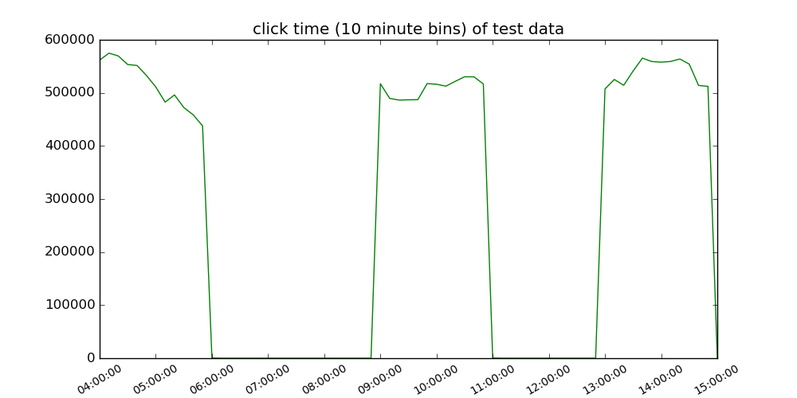
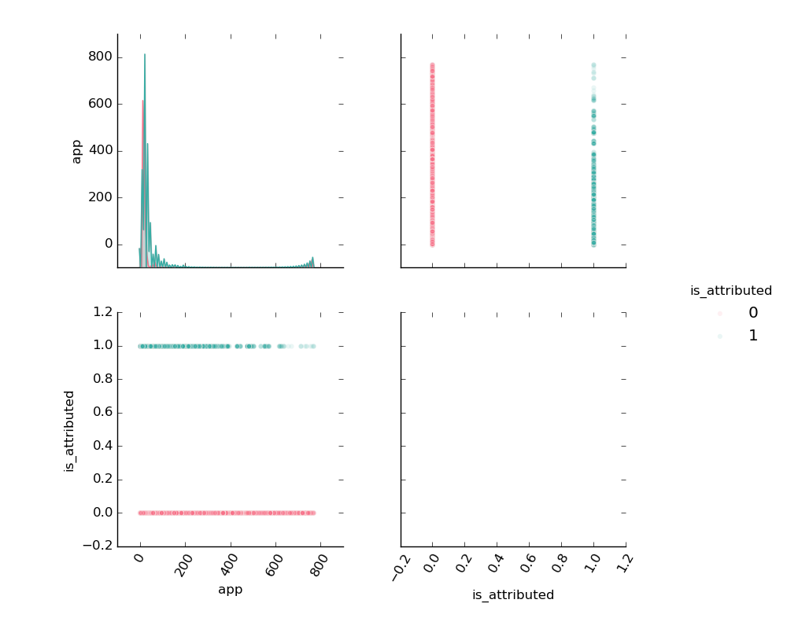
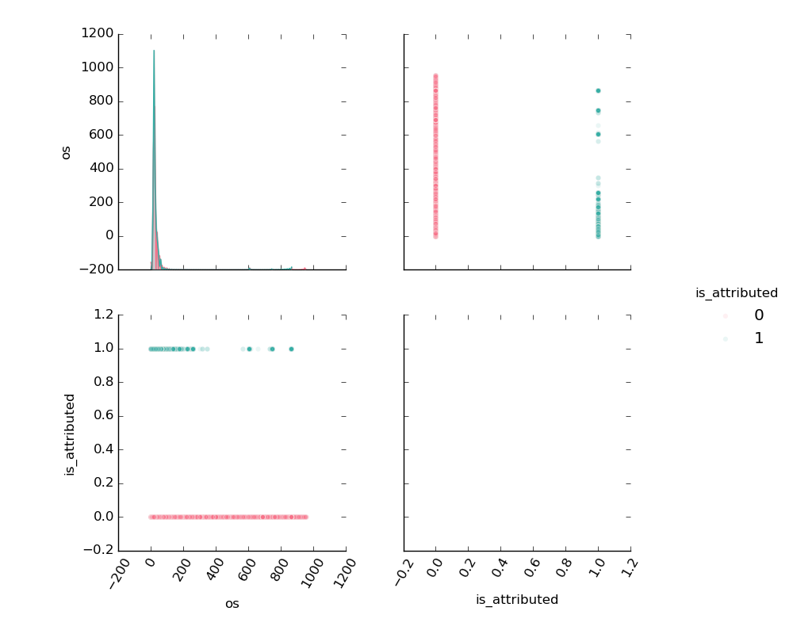

##### TalkingData AdTracking Fraud Detection Challenge
# 1. EDA
[source code](01_EDA.py) <br>

## Import library and Load datasets
```python
import pandas as pd
import numpy as np

import seaborn as sns
import matplotlib.pyplot as plt

import gc

train = pd.read_csv("data/train.csv", parse_dates=['click_time', 'attributed_time'])
test = pd.read_csv('data/test.csv', parse_dates=['click_time'])
gc.collect()
```

<br>

## Explor data

##### Data Shape

| Data | Col | Row |
|------|-----|-----|
| Train | 8 | 184,903,890 |
| Test | 7 | 18,790,469 |

> The data is very large!!!

<br>

##### Data Columns

| Data | Columns |
|------|---------|
| Train | ip, app, device, os, channel, click_time, attributed_time, is_attributed |
| Test | click_id, ip, app, device, os, channel, click_time |

<br>

##### Data Head


<br>

##### Missing Values


<br>

## Check level size of variable

| data | ip | app | device | os | channel |
|------|----|-----|--------|----|---------|
| train |  |  |  |  |  |
| test |  |  |  |  |  |

> There are too many levels.

<br>

### Check download frequency

| Target | Count |
|--------|-------|
| Not Download | 18,447,044 |
| Download | 456,846 |

> Have very few downloads.

<br>

### Check 'click_time'

##### Year

| Data | Year | Count|
|------|------|------|
| Train | 2017 | 184,903,890 |
| Test | 2017 | 18,790,469 |

##### Month

| Data | Month | Count |
|------|-------|-------|
| Train | 11 | 184,903,890 |
| Test | 11 | 18,790,469 |

##### Day

| Data | Day | Count |
|------|-----|-------|
| Train | 6 | 9,308,568 |
| Train | 7 | 59,633,310 |
| Train | 8 | 62,945,075 |
| Train | 9 | 53,016,937 |
| Test | 10 | 18,790,469 |

<br>

---

### Draws a time series of train data click time

```python
temp = train['click_time']
temp.index = train['click_time']
temp = temp.resample('10T').count()

plt.figure(figsize=(10,5))
plt.title('click time (10 minute bins) of train data')
plt.plot(temp.index, temp, 'g')
plt.xticks(label=[])
plt.savefig('graph/train_click_time.png')
plt.show()
gc.collect()
```


> There is a constant time zone with a high number of clicks.

<br>

### Draws a time series of test data click time

```python
temp = test['click_time']
temp.index = test['click_time']
temp = temp.resample('10T').count()

plt.figure(figsize=(10,5))
plt.title('click time (10 minute bins) of test data')
plt.plot(temp.index, temp, 'g')
plt.xticks(rotation=30, fontsize="small")
plt.savefig('graph/test_click_time.png')
plt.show()
gc.collect()
```



> Test data is the data from 4 o'clock to 15 o'clock.

<br>

### Draws a time series of downloaded click time and attributed time

```python
temp1 = train['is_attributed']
temp1.index = train['click_time']
temp1 = temp1.resample('10T').sum()

temp2 = train['is_attributed']
temp2.index = train['attributed_time']
temp2 = temp2.resample('10T').sum()

plt.figure(figsize=(10,5))
plt.title('click time and attributed time')
plt.plot(temp1.index, temp1, 'g', label='click time')
plt.plot(temp2.index, temp2, 'r', label='attributed time')
plt.legend(loc='lower right', fontsize='small')
plt.savefig('graph/train_click_download.png')
plt.show()
gc.collect()
```


<br>

### Make a derived variable : hour

```python
train['hour'] = np.nan
train['hour'] = train['click_time'].dt.hour

test['hour'] = np.nan
test['hour'] = test['click_time'].dt.hour
gc.collect()
```

<br>

### Draw hour bar graphs

```python
plt.figure(figsize=(15,10))

plt.subplot(2,1,1)
plt.title('click count per hour in train data')
sns.countplot('hour', data=train, linewidth=0)

plt.subplot(2,1,2)
plt.title('click count per hour in test data')
sns.countplot('hour', data=test, linewidth=0)

plt.savefig('graph/hour_click_count.png')
plt.show()
gc.collect()
```


<br>

### Draw hour and download bar graphs
```python
plt.figure(figsize=(15,15))

plt.subplot(3,1,1)
plt.title('click count per hour in train data')
sns.countplot('hour', data=train)

plt.subplot(3,1,2)
plt.title('download count per hour')
sns.barplot('hour', 'is_attributed', data=train, estimator=sum, ci=None)

plt.subplot(3,1,3)
plt.title('download rate by per hour')
sns.barplot('hour', 'is_attributed', data=train, ci=None)

plt.savefig('graph/hour_download_rate.png')
plt.show()
gc.collect()
```


<br>

---

### Merge trian data and test data

```python
del train['attributed_time']
test['is_attributed'] = 0
data = pd.concat([train, test])

del train
del test
gc.collect()
```

merged data shape : (203694359, 9)

<br>

### Separate and save each variable

```python
for feat in data.columns:
    temp = data[feat].reset_index()
    temp.to_csv('data/merge_' + feat + '.csv', index=False, columns=['index',feat])
```

<br>

---

### Make black list

```python
def make_black_list(v):
    temp = data[v].value_counts().reset_index()
    temp.columns = [v,'count']
    temp.sort_values(ascending=False, by='count', inplace=True)

    temp2 = data.groupby(v)['is_attributed'].sum().reset_index()
    temp2.columns = [v,'download']
    temp = temp.merge(temp2, on=v, how='left')

    print('sort by count')
    print(temp.head(30))
    print(temp.tail(30))
    print()

    temp.sort_values(ascending=False, by='download', inplace=True)

    print('sort by download')
    print(temp.head(30))
    print(temp.tail(30))
    print()

    temp['gap'] = temp['count'] - temp['download']
    temp.sort_values(ascending=False, by='gap', inplace=True)

    print('sort by gap')
    print(temp.head(30))
    print(temp.tail(30))
    print()

    temp['rate'] = temp['download'] / temp['count']
    temp.sort_values(ascending=False, by='rate', inplace=True)

    print('sort by rate')
    print(temp.head(30))
    print(temp.tail(30))
    print()

    count_boundary = temp['count'].median() + 10
    rate_boundary = temp['rate'].mean()
    print('count boundary : ', count_boundary)
    print('rate boundary : ', rate_boundary)

    temp['black_' + v] = 0
    temp.loc[(temp['count'] > count_boundary) & (temp['rate'] < rate_boundary), 'black_' + v] = 1
    temp.sort_values(by=v, inplace=True)

    print('check black list')
    print(temp.head(30))
    print(temp.tail(30))
    print('count : ', temp['black_' + v].sum())

    return temp
```

```python
ip = make_black_list('ip')
app = make_black_list('app')
device = make_black_list('device')
os = make_black_list('os')
channel = make_black_list('channel')
hour = make_black_list('hour')
```

| Variable | Black List Count |
|----------|------------------|
| ip | 132,723 |
| app | 267 |
| device | 544 |
| os | 252 |
| channel | 98 |
| hour | 7 |

<br>

---

### Draw bar graphs

```python
def barplot(data, v):
    temp1 = data.head(30)
    temp2 = data.tail(30)
    plt.figure(figsize=(20,15))

    plt.subplot(3,2,1)
    plt.title('click count per ' + v + ' (top)')
    sns.barplot(v, 'count', data=temp1, linewidth=0)
    plt.xticks(rotation=90, fontsize="small")

    plt.subplot(3,2,2)
    plt.title('(bottom)')
    sns.barplot(v, 'count', data=temp2, linewidth=0)
    plt.xticks(rotation=90, fontsize="small")

    plt.subplot(3,2,3)
    plt.title('download count per ' + v + ' (top)')
    sns.barplot(v, 'download', data=temp1, linewidth=0, estimator=sum, ci=None)
    plt.xticks(rotation=90, fontsize="small")

    plt.subplot(3,2,4)
    plt.title('(bottom)')
    sns.barplot(v, 'download', data=temp2, linewidth=0, estimator=sum, ci=None)
    plt.xticks(rotation=90, fontsize="small")

    plt.subplot(3,2,5)
    plt.title('download rate per ' + v + ' (top)')
    sns.barplot(v, 'rate', data=temp1, linewidth=0, ci=None)
    plt.xticks(rotation=90, fontsize="small")

    plt.subplot(3,2,6)
    plt.title('(bottom)')
    sns.barplot(v, 'rate', data=temp2, linewidth=0, ci=None)
    plt.xticks(rotation=90, fontsize="small")

    plt.savefig('graph/' + v + '_download_rate.png')
    plt.show()
    gc.collect()
```

```python
ip.sort_values(ascending=False, by='count', inplace=True)
barplot(ip, 'ip')
```


```python
app.sort_values(ascending=False, by='count', inplace=True)
barplot(app, 'app')
```


```python
device.sort_values(ascending=False, by='count', inplace=True)
barplot(device, 'device')
```


```python
os.sort_values(ascending=False, by='count', inplace=True)
barplot(os, 'os')
```


```python
channel.sort_values(ascending=False, by='count', inplace=True)
barplot(channel, 'channel')
```


<br>

---

### Draw scatter plots

```python
def scatter_plot(feat, file_name):
    temp = data[feat].loc[data['click_id'].isnull()]

    g = sns.pairplot(temp,
                     hue='is_attributed',
                     palette="husl",
                     plot_kws={'alpha':0.1})

    for ax in g.axes.flat:
        for label in ax.get_xticklabels():
            label.set_rotation(90)

    g.fig.set_size_inches(10,10)
    plt.savefig('graph/'+file_name+'.png')
    plt.show()
    gc.collect()
```

```python
feat = ['is_attributed', 'ip']
scatter_plot(feat, 'scatter_plot_ip')
```


```python
feat = ['is_attributed', 'app']
scatter_plot(feat, 'scatter_plot_app')
```



```python
feat = ['is_attributed', 'device']
scatter_plot(feat, 'scatter_plot_device')
```


```python
feat = ['is_attributed', 'os']
scatter_plot(feat, 'scatter_plot_os')
```



```python
feat = ['is_attributed', 'channel']
scatter_plot(feat, 'scatter_plot_channel')
```


```python
feat = ['is_attributed', 'hour']
scatter_plot(feat, 'scatter_plot_hour')
```


