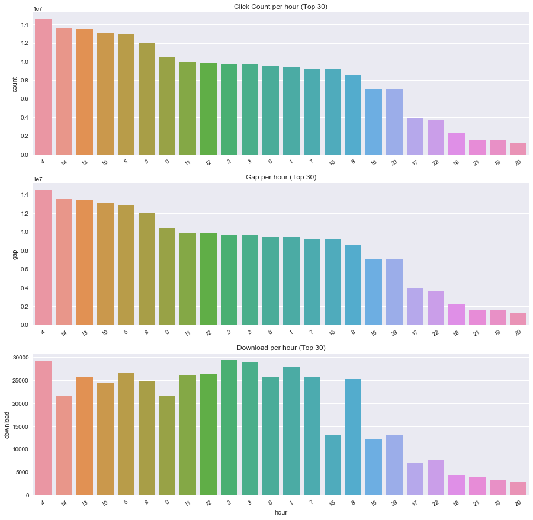

##### TalkingData AdTracking Fraud Detection Challenge
# 1. EDA
[source code](01_EDA.py) <br>

Explor train and test datasets.

<br>

---

## Import library and load datasets
```python
import pandas as pd
import numpy as np

import seaborn as sns
import matplotlib.pyplot as plt

import gc

train = pd.read_csv("data/train.csv", parse_dates=['click_time', 'attributed_time'])
test = pd.read_csv('data/test.csv', parse_dates=['click_time'])
gc.collect()
```

<br>

## Explor data

#### Data Shape

| Data | Col | Row |
|:----:|:---:|----:|
| Train | 8 | 184,903,890 |
| Test | 7 | 18,790,469 |

> The data is very large!!!

<br>

#### Data Columns

| Data | Columns |
|:----:|---------|
| Train | ip, app, device, os, channel, click_time, attributed_time, is_attributed |
| Test | click_id, ip, app, device, os, channel, click_time |

<br>

#### Data Head

* Train

| ip | app | device | os | channel | click_time | attributed_time | is_attributed |
|:--:|:---:|:------:|:--:|:-------:|:----------:|:---------------:|:-------------:|
| 83230 | 3 | 1 | 13 | 379 | 2017-11-06 14:32:21 | NaN | 0 |
| 17357 | 3 | 1 | 19 | 379 | 2017-11-06 14:33:34 | NaN | 0 |
| 35810 | 3 | 1 | 13 | 379 | 2017-11-06 14:34:12 | NaN | 0 |
| 45745 | 14 | 1 | 13 | 478 | 2017-11-06 14:34:52 | NaN | 0 |
| 161007 | 3 | 1 | 13 | 379 | 2017-11-06 14:35:08 | NaN | 0 |

<br>

* Test

| click_id | ip | app | device | os | channel | click_time |
|:--------:|:--:|:---:|:------:|:--:|:-------:|:----------:|
| 0 | 5744 | 9 | 1 | 3 | 107 | 2017-11-10 04:00:00 |
| 1 | 119901 | 9 | 1 | 3 | 466 | 2017-11-10 04:00:00 |
| 2 | 72287 | 21 | 1 | 19 | 128 | 2017-11-10 04:00:00 |
| 3 | 78477 | 15 | 1 | 13 | 111 | 2017-11-10 04:00:00 |
| 4 | 123080 | 12 | 1 | 13 | 328 | 2017-11-10 04:00:00 |

<br>

## Check missing values

* Train

| ip | app | device | os | channel | click_time | attributed_time | is_attributed |
|:--:|:---:|:------:|:--:|:-------:|:----------:|:---------------:|:-------------:|
| 0 | 0 | 0 | 0 | 0 | 0 | 184,447,004 | 0 |

> attributed_time value is NaN if is_attributed value is 0.

<br>

* Test

| click_id | ip | app | device | os | channel | click_time |
|:--------:|:--:|:---:|:------:|:--:|:-------:|:----------:|
| 0 | 0 | 0 | 0 | 0 | 0 | 0 |


<br>

## Check level size of factors

| Data | ip | app | device | os | channel |
|:----:|---:|----:|-------:|---:|--------:|
| Train | 277,396 | 406 | 3,475 | 800 | 202 |
| Test | 93,936 | 417 | 1,985 | 395 | 178 |

> There are too many levels.

<br>

## Check download frequency

| Target | Count |
|:------:|------:|
| Not Downloaded | 18,447,044 |
| Downloaded | 456,846 |

> Have very few downloads.

<br>

## Check 'click_time'

* Train

| Year | Month | Day | Count|
|:----:|:-----:|:---:|-----:|
| 2017 | 11 | 6 | 9,308,568 |
| 2017 | 11 | 7 | 59,633,310 |
| 2017 | 11 | 8 | 62,945,075 |
| 2017 | 11 | 9 | 53,016,937 |

<br>

* Test

| Year | Month | Day | Count|
|:----:|:-----:|:---:|-----:|
| 2017 | 11 | 10 | 18,790,469 |

<br>

---

## Draw a time series of click time in train data

```python
temp = train['click_time']
temp.index = train['click_time']
temp = temp.resample('10T').count()

plt.figure(figsize=(10,5))
plt.title('click time (10 minute bins) of train data')
plt.plot(temp.index, temp, 'g')
plt.xticks(label=[])
plt.savefig('graph/train_click_time.png')
plt.show()
gc.collect()
```


> There is a constant time zone with a high number of clicks.

<br>

## Draw a time series of click time in test data

```python
temp = test['click_time']
temp.index = test['click_time']
temp = temp.resample('10T').count()

plt.figure(figsize=(10,5))
plt.title('click time (10 minute bins) of test data')
plt.plot(temp.index, temp, 'g')
plt.xticks(rotation=30, fontsize="small")
plt.savefig('graph/test_click_time.png')
plt.show()
gc.collect()
```


> Test data is the data from 4 o'clock to 15 o'clock.

<br>

## Draw a time series of click time and attributed time

```python
temp1 = train['is_attributed']
temp1.index = train['click_time']
temp1 = temp1.resample('10T').sum()

temp2 = train['is_attributed']
temp2.index = train['attributed_time']
temp2 = temp2.resample('10T').sum()

plt.figure(figsize=(10,5))
plt.title('click time and attributed time')
plt.plot(temp1.index, temp1, 'g', label='click time')
plt.plot(temp2.index, temp2, 'r', label='attributed time')
plt.legend(loc='lower right', fontsize='small')
plt.savefig('graph/train_click_download.png')
plt.show()
gc.collect()
```


<br>

---

## Make a feature : hour

```python
train['hour'] = np.nan
train['hour'] = train['click_time'].dt.hour

test['hour'] = np.nan
test['hour'] = test['click_time'].dt.hour
gc.collect()
```

<br>

## Merge train data and test data

```python
del train['attributed_time']
test['is_attributed'] = 0
data = pd.concat([train, test])

del train
del test
gc.collect()

data.to_csv('data/merge.csv', index=False)
del data
gc.collect()
```

* merged data shape : (203694359, 9)

<br>

---

## Make count, gap, rate and black list per feature (ip, app, device, os, channel, hour)

```python
def make_black_list(v):
    x = pd.read_csv('data/merge.csv', usecols=[v, 'is_attributed'])

    temp = x[v].value_counts().reset_index()
    temp.columns = [v,'count']
    temp.sort_values(ascending=False, by='count', inplace=True)

    temp2 = x.groupby(v)['is_attributed'].sum().reset_index()
    temp2.columns = [v,'download']
    temp = temp.merge(temp2, on=v, how='left')

    print('sort by count')
    print(temp.head(30))
    print(temp.tail(30))
    print()

    temp.sort_values(ascending=False, by='download', inplace=True)

    print('sort by download')
    print(temp.head(30))
    print(temp.tail(30))
    print()

    temp['gap'] = temp['count'] - temp['download']
    temp.sort_values(ascending=False, by='gap', inplace=True)

    print('sort by gap')
    print(temp.head(30))
    print(temp.tail(30))
    print()

    temp['rate'] = temp['download'] / temp['count']
    temp.sort_values(ascending=False, by='rate', inplace=True)

    print('sort by rate')
    print(temp.head(30))
    print(temp.tail(30))
    print()

    count_boundary = temp['count'].median() + 10
    rate_boundary = temp['rate'].mean()
    print('count boundary : ', count_boundary)
    print('rate boundary : ', rate_boundary)

    temp['black_' + v] = 0
    temp.loc[(temp['count'] > count_boundary) & (temp['rate'] < rate_boundary), 'black_' + v] = 1
    temp.sort_values(by=v, inplace=True)

    print('check black list')
    print(temp.head(30))
    print(temp.tail(30))
    print('count : ', temp['black_' + v].sum())

    temp.to_csv('blacklist/' + v + '_black.csv', index=False)
    return temp
```

| Feature | Level Size | Black List Count |
|---------|-----------:|-----------------:|
| ip | 333,168 | 132,723 |
| app | 730 | 267 |
| device | 3,799 | 544 |
| os | 856 | 252 |
| channel | 202 | 98 |
| hour | 24 | 7 |

<br>

---

## Draw bar graphs

* ip


> Depending on the type of ip, the degree of download is a few difference.

<br>

* app


> Depending on the type of app, the degree of download is noticeable. <br>
> Thus, it is a very **important feature**.

<br>

* device


> The type of device with many clicks is one-sided. <br>
> Thus, it is not an important feature.

<br>

* os


>  Depending on the type of os, the degree of download is not a great difference. <br>
> Thus, it is not an important feature.

<br>

* channel


> Depending on the type of channel, the degree of download is noticeable. <br>
> Thus, it is a very **important feature**.

<br>

* hour



>  Depending on the type of hour, the degree of download is not a great difference. <br>
> Thus, it is not an important feature.

<br>

---

[Contents](README.md) <br>
[2. Preprocessing](02_Preprocessing.md)
