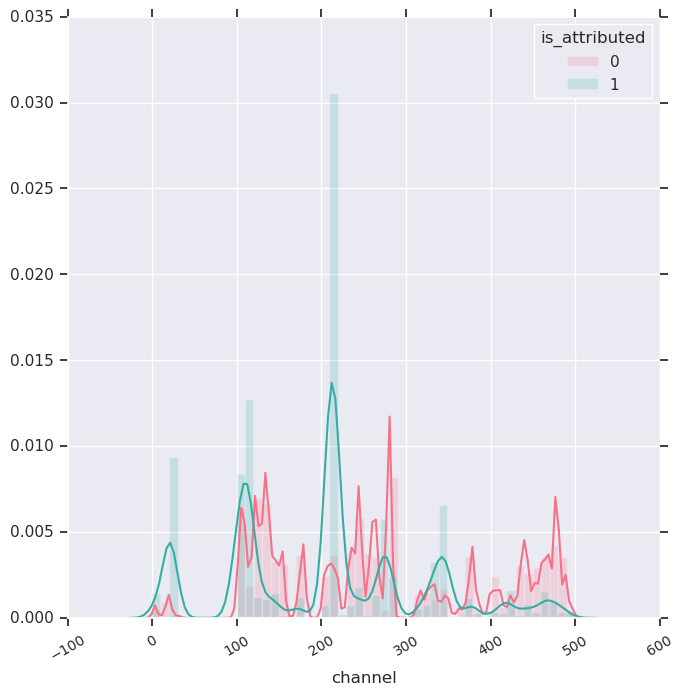

##### TalkingData AdTracking Fraud Detection Challenge
# 1. EDA
[source code](01_EDA.py)

<br>

---

## Import library and load datasets
```python
import pandas as pd
import numpy as np

import seaborn as sns
import matplotlib.pyplot as plt

import gc

train = pd.read_csv("data/train.csv", parse_dates=['click_time', 'attributed_time'])
test = pd.read_csv('data/test.csv', parse_dates=['click_time'])
gc.collect()
```

<br>

## Explor data

#### Data Shape

| Data | Col | Row |
|------|-----|----:|
| Train | 8 | 184,903,890 |
| Test | 7 | 18,790,469 |

> The data is very large!!!

<br>

#### Data Columns

| Data | Columns |
|------|---------|
| Train | ip, app, device, os, channel, click_time, attributed_time, is_attributed |
| Test | click_id, ip, app, device, os, channel, click_time |

<br>

#### Data Head

|
|
|
|
|
|

<br>

## Check missing values

#### Train

#### Test


<br>

## Check level size of feature

| data | ip | app | device | os | channel |
|------|----|-----|--------|----|---------|
| train |  |  |  |  |  |
| test |  |  |  |  |  |

> There are too many levels.

<br>

## Check download frequency

| Target | Count |
|--------|------:|
| Not Downloaded | 18,447,044 |
| Downloaded | 456,846 |

> Have very few downloads.

<br>

## Check 'click_time'

#### Train

| Year | Month | Day | Count|
|------|-------|-----|-----:|
| 2017 | 11 | 6 | 9,308,568 |
| 2017 | 11 | 7 | 59,633,310 |
| 2017 | 11 | 8 | 62,945,075 |
| 2017 | 11 | 9 | 53,016,937 |

<br>

##### Test

| Year | Month | Day | Count|
|------|-------|-----|-----:|
| 2017 | 11 | 10 | 18,790,469 |

<br>

---

## Draws a time series of train data click time

```python
temp = train['click_time']
temp.index = train['click_time']
temp = temp.resample('10T').count()

plt.figure(figsize=(10,5))
plt.title('click time (10 minute bins) of train data')
plt.plot(temp.index, temp, 'g')
plt.xticks(label=[])
plt.savefig('graph/train_click_time.png')
plt.show()
gc.collect()
```


> There is a constant time zone with a high number of clicks.

<br>

## Draws a time series of test data click time

```python
temp = test['click_time']
temp.index = test['click_time']
temp = temp.resample('10T').count()

plt.figure(figsize=(10,5))
plt.title('click time (10 minute bins) of test data')
plt.plot(temp.index, temp, 'g')
plt.xticks(rotation=30, fontsize="small")
plt.savefig('graph/test_click_time.png')
plt.show()
gc.collect()
```


> Test data is the data from 4 o'clock to 15 o'clock.

<br>

## Draws a time series of downloaded click time and attributed time

```python
temp1 = train['is_attributed']
temp1.index = train['click_time']
temp1 = temp1.resample('10T').sum()

temp2 = train['is_attributed']
temp2.index = train['attributed_time']
temp2 = temp2.resample('10T').sum()

plt.figure(figsize=(10,5))
plt.title('click time and attributed time')
plt.plot(temp1.index, temp1, 'g', label='click time')
plt.plot(temp2.index, temp2, 'r', label='attributed time')
plt.legend(loc='lower right', fontsize='small')
plt.savefig('graph/train_click_download.png')
plt.show()
gc.collect()
```


<br>

---

## Makes a feature : hour

```python
train['hour'] = np.nan
train['hour'] = train['click_time'].dt.hour

test['hour'] = np.nan
test['hour'] = test['click_time'].dt.hour
gc.collect()
```

<br>

## Merge trian data and test data

```python
del train['attributed_time']
test['is_attributed'] = 0
data = pd.concat([train, test])

del train
del test
gc.collect()

data.to_csv('data/merge.csv', index=False)
del data
gc.collect()
```

merged data shape : (203694359, 9)

<br>

---

## Make black list

```python
def make_black_list(v):
    x = pd.read_csv('data/merge.csv', usecols=[v, 'is_attributed'])

    temp = x[v].value_counts().reset_index()
    temp.columns = [v,'count']
    temp.sort_values(ascending=False, by='count', inplace=True)

    temp2 = x.groupby(v)['is_attributed'].sum().reset_index()
    temp2.columns = [v,'download']
    temp = temp.merge(temp2, on=v, how='left')

    print('sort by count')
    print(temp.head(30))
    print(temp.tail(30))
    print()

    temp.sort_values(ascending=False, by='download', inplace=True)

    print('sort by download')
    print(temp.head(30))
    print(temp.tail(30))
    print()

    temp['gap'] = temp['count'] - temp['download']
    temp.sort_values(ascending=False, by='gap', inplace=True)

    print('sort by gap')
    print(temp.head(30))
    print(temp.tail(30))
    print()

    temp['rate'] = temp['download'] / temp['count']
    temp.sort_values(ascending=False, by='rate', inplace=True)

    print('sort by rate')
    print(temp.head(30))
    print(temp.tail(30))
    print()

    count_boundary = temp['count'].median() + 10
    rate_boundary = temp['rate'].mean()
    print('count boundary : ', count_boundary)
    print('rate boundary : ', rate_boundary)

    temp['black_' + v] = 0
    temp.loc[(temp['count'] > count_boundary) & (temp['rate'] < rate_boundary), 'black_' + v] = 1
    temp.sort_values(by=v, inplace=True)

    print('check black list')
    print(temp.head(30))
    print(temp.tail(30))
    print('count : ', temp['black_' + v].sum())

    temp.to_csv('blacklist/' + v + '_black.csv', index=False)
    return temp
```

```python
ip = make_black_list('ip')
app = make_black_list('app')
device = make_black_list('device')
os = make_black_list('os')
channel = make_black_list('channel')
hour = make_black_list('hour')
```

| Feature | Level Size | Black List Count |
|---------|-----------:|-----------------:|
| ip | 333,168 | 132,723 |
| app | 730 | 267 |
| device | 3,799 | 544 |
| os | 856 | 252 |
| channel | 202 | 98 |
| hour | 24 | 7 |

<br>

---

## Draw bar graphs

```python
def bar(x, v):
    order = x.sort_values(ascending=False, by='count')
    order = order[v].iloc[:30].tolist()

    sns.set(rc={'figure.figsize':(15,15)})

    plt.subplot(3,1,1)
    plt.title('Click Count per ' + v + ' (Top 30)')
    sns.barplot(v, 'count', data=x, linewidth=0, order=order)
    plt.xticks(rotation=30, fontsize="small")
    plt.xlabel('')

    plt.subplot(3,1,2)
    plt.title('Gap per ' + v + ' (Top 30)')
    sns.barplot(v, 'gap', data=x, linewidth=0, order=order)
    plt.xticks(rotation=30, fontsize="small")
    plt.xlabel('')

    plt.subplot(3,1,3)
    plt.title('Download per ' + v + ' (Top 30)')
    sns.barplot(v, 'download', data=x, linewidth=0, order=order)
    plt.xticks(rotation=30, fontsize="small")

    plt.savefig('graph/bar_' + v + '.png', bbox_inches='tight')
    plt.show()
    gc.collect()
```

```python
bar(ip, 'ip')
```


```python
bar(app, 'app')
```


```python
bar(device, 'device')
```


```python
bar(os, 'os')
```


```python
bar(channel, 'channel')
```


```python
bar(hour, 'hour')
```


<br>

---

## Draw distribution

```python
def dist(a):
    df = pd.read_csv('data/train.csv', usecols=[a, 'is_attributed'])

    g =  sns.FacetGrid(df, hue='is_attributed', height=7, palette='husl')
    g = g.map(sns.distplot, a, hist_kws={'alpha':0.2})

    plt.xticks(rotation=30, fontsize="small")
    plt.legend(loc='upper right').set_title('is_attributed')
    plt.savefig('graph/dist_' + a + '.png', bbox_inches='tight')
    plt.show()
    gc.collect()
```

```python
dist('ip')
```


```python
dist('app')
```


```python
dist('device')
```


```python
dist('os')
```


```python
dist('channel')
```



<br>

---

[Contents](README.md)
