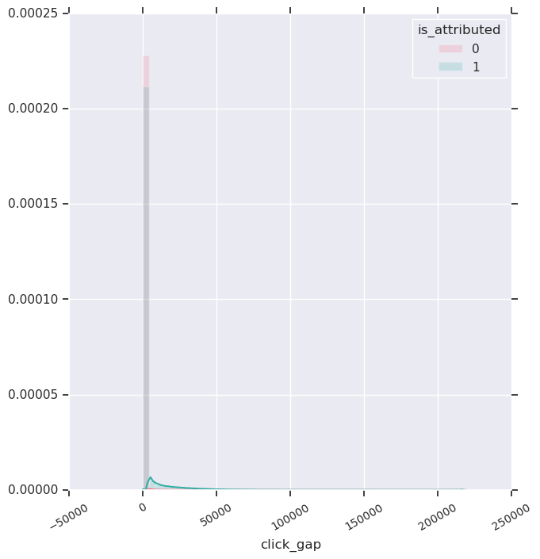
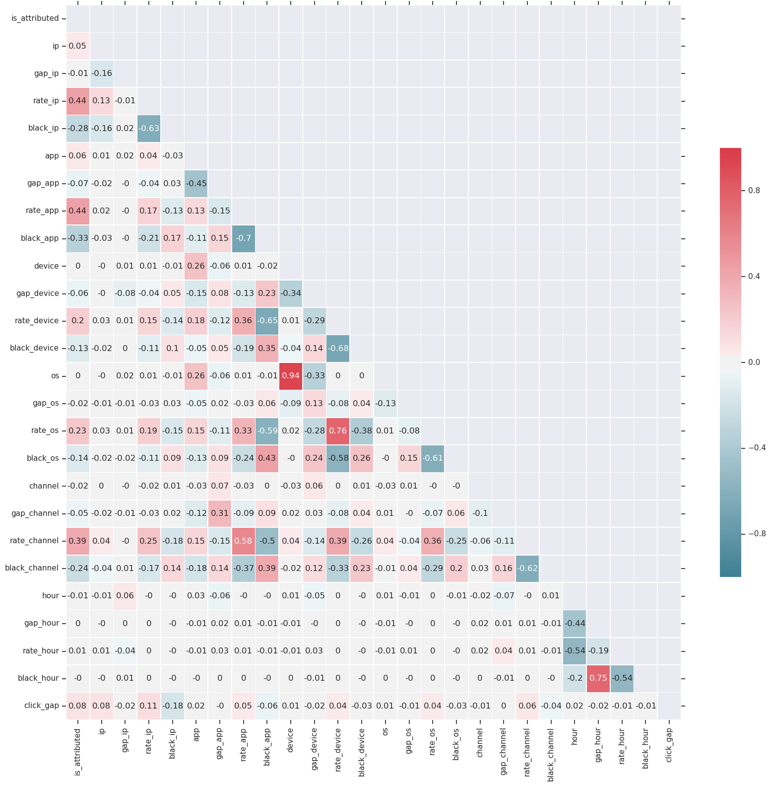

##### TalkingData AdTracking Fraud Detection Challenge
# 2. Preprocessing
[source code](02_Preprocessing.py) <br>

Make features and draw graphs.

<br>

---

## Import library

```python
import pandas as pd
import numpy as np

import seaborn as sns
import matplotlib.pyplot as plt

import gc

train_test_boundary = 184903890
```

<br>

## Make features : gap, black and rate per (ip, app, device, os, channel, hour)

```python
def merge_black(feat):
    df = pd.read_csv('data/merge.csv', usecols=[feat])    
    black = pd.read_csv('blacklist/' + feat + '_black.csv', usecols=[feat, 'gap','black_'+feat, 'rate'])

    df = df.merge(black, on=feat, how='left')
    df.rename(columns={'gap':'gap_'+feat}, inplace = True)
    df.rename(columns={'rate':'rate_'+feat}, inplace = True)
    gc.collect()

    df.to_csv('data/merge_' + feat + '.csv', index=False)
```

```python
for feat in ['ip', 'app', 'device', 'os', 'channel', 'hour']:
    merge_black(feat)
```

<br>

## Make a feature : click_gap

```python
data = pd.read_csv('data/merge.csv', usecols=['ip', 'click_time'])
data = data.reset_index()
data.sort_values(by=['ip', 'click_time'], inplace=True)

data['i'] = np.arange(0, len(data))
data = data.set_index('i')
data['click_time'] = pd.to_datetime(data['click_time'])

temp = data.loc[:len(data) - 1, 'click_time']
temp = temp.reset_index()

temp['i'] = np.arange(1, len(temp)+1)
temp =  temp.set_index('i')
temp.loc[0] = np.nan

data['click_gap'] = np.nan
data['click_gap'] = temp
data['click_gap'] = data['click_time'] - data['click_gap']

data['i'] = np.arange(0, len(data))
index = data.groupby('ip')['i'].min()
index = list(index)

data.loc[index, 'click_gap'] = -1
data['click_gap'] = data['click_gap'].astype('timedelta64[s]')
data.sort_values(by='index', ascending=True, inplace=True)
data = data.set_index('index')

temp = data['click_gap']
temp.to_csv('data/merge_click_gap.csv', index=False, header=True)

del data
del temp
gc.collect()
```

<br>

---

## Concat data

```python
data = pd.read_csv('data/merge.csv', usecols=['is_attributed'])

for feat in ['ip','app','device','os','channel','hour', 'click_gap']:
    temp = pd.read_csv('data/merge_' + feat +'.csv')
    data = pd.concat([data, temp], axis=1)
    del temp
    gc.collect()

data.to_csv('data/merge_add_features.csv', index=False)
```

<br>

## Divid data

```python
train = data.iloc[:train_test_boundary]
test = data.iloc[train_test_boundary:]

del data
gc.collect()

train.to_csv('data/train_add_features.csv', index=False)
test.to_csv('data/test_add_features.csv', index=False)

del train
del test
gc.collect()
```

<br>

---

## Draw distribution

```python
def dist(a):
    df = pd.read_csv('data/train_add_features.csv', usecols=[a, 'is_attributed'])

    g =  sns.FacetGrid(df, hue='is_attributed', size=7, palette='husl')
    g = g.map(sns.distplot, a, hist_kws={'alpha':0.2})

    plt.xticks(rotation=30, fontsize="small")
    plt.legend(loc='upper right').set_title('is_attributed')
    plt.savefig('graph/dist_' + a + '.png', bbox_inches='tight')
    plt.show()
    gc.collect()
```

```python
dist('gap_ip')
```


```python
dist('rate_ip')
```


```python
dist('gap_app')
```


```python
dist('rate_app')
```


```python
dist('gap_device')
```


```python
dist('rate_device')
```


```python
dist('gap_os')
```


```python
dist('rate_os')
```


```python
dist('gap_channel')
```


```python
dist('rate_channel')
```


```python
dist('gap_hour')
```


```python
dist('rate_hour')
```


```python
dist('click_gap')
```



<br>

## Draw a scatter plot

```python
def scatter(feat):
    x = pd.read_csv('data/train_add_features.csv', usecols=feat+['is_attributed'])

    g = sns.pairplot(x,
                     vars=feat,
                     hue='is_attributed',
                     palette="husl",
                     plot_kws={'alpha':0.1})

    for ax in g.axes.flat:
        for label in ax.get_xticklabels():
            label.set_rotation(60)

    g.fig.set_size_inches(20,18)
    plt.savefig('graph/scatter.png', bbox_inches='tight')
    plt.show()
    gc.collect()
```

```python
scatter(['gap_ip', 'gap_app', 'gap_device', 'gap_os', 'gap_channel'])
```


<br>

## Draw bar graphs

```python
def bar(x):
    df = pd.read_csv('data/train_add_features.csv', usecols=[x, 'is_attributed'])

    sns.set(rc={'figure.figsize':(12,5)})

    temp = df.loc[df['is_attributed'] == 0]
    plt.subplot(1,2,1)
    plt.title('Not Downloaded')
    sns.countplot(x, data=temp, linewidth=0, palette='husl')

    temp = df.loc[df['is_attributed'] == 1]
    plt.subplot(1,2,2)
    plt.title('Downloaded')
    sns.countplot(x, data=temp, linewidth=0, palette='husl')

    plt.savefig('graph/bar_' + x + '.png', bbox_inches='tight')
    plt.show()
    gc.collect()
```

```python
bar('black_ip')
```


```python
bar('black_app')
```


```python
bar('black_device')
```


```python
bar('black_os')
```


```python
bar('black_channel')
```


```python
bar('black_hour')
```


<br>

## Draw a bar graph of 'click_gap' and 'is_attributed'

```python
train = pd.read_csv('data/train_add_features.csv', usecols=['click_gap', 'is_attributed'])

sns.set(rc={'figure.figsize':(15,10)})

temp = train.loc[train['is_attributed'] == 0]
plt.subplot(2,1,1)
plt.title('Not Downloaded')
sns.countplot('click_gap', data=temp, linewidth=0)
plt.xlim((-1,20))

temp = train.loc[train['is_attributed'] == 1]
plt.subplot(2,1,2)
plt.title('Downloaded')
sns.countplot('click_gap', data=temp, linewidth=0)
plt.xlim((-1,20))

plt.savefig('graph/bar_click_gap.png', bbox_inches='tight')
plt.show()
gc.collect()
```


<br>

## Check correlation

```python
train = pd.read_csv('data/train_add_features.csv')
corr = train.corr(method='pearson')
corr = corr.round(2)
mask = np.zeros_like(corr, dtype=np.bool)
mask[np.triu_indices_from(mask)] = True
cmap = sns.diverging_palette(220, 10, as_cmap=True)

sns.set(rc={'figure.figsize':(20,18)})
sns.heatmap(corr, vmin=-1, vmax=1,
            mask=mask, cmap=cmap, annot=True, linewidth=.5, cbar_kws={'shrink':.6})
plt.savefig('graph/heatmap.png', bbox_inches='tight')
plt.show()
gc.collect()
```



<br>

---

[Contents](README.md) <br>
[1. EDA](01_EDA.md) <br>
[3. Sampling](03_Sampling.md)
