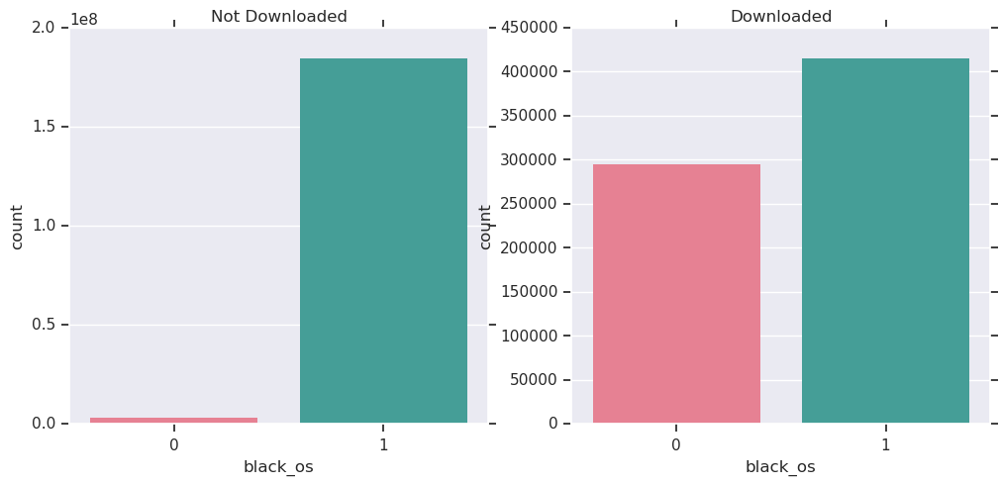
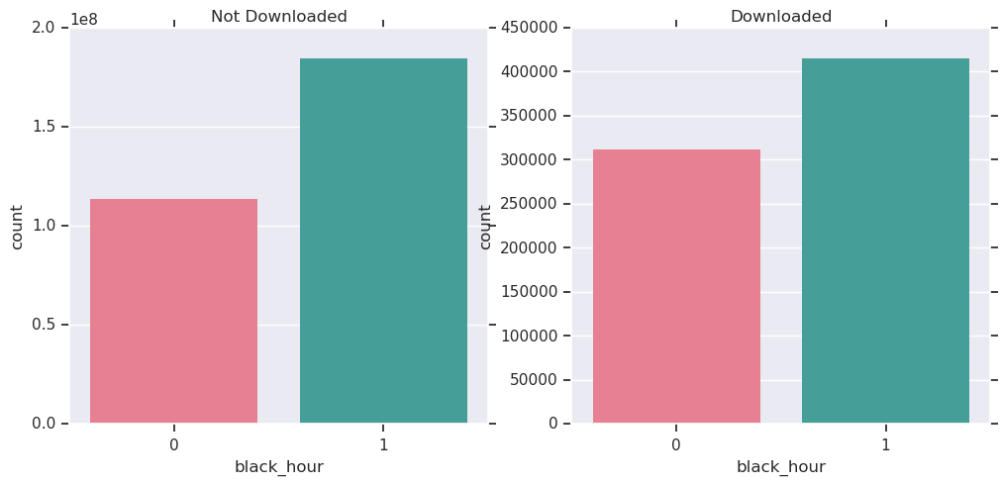

##### TalkingData AdTracking Fraud Detection Challenge
# 2. Preprocessing
[source code](02_Preprocessing.py) <br>

Make features and draw graphs.

<br>

---

## Import library

```python
import pandas as pd
import numpy as np

import seaborn as sns
import matplotlib.pyplot as plt

import gc

train_test_boundary = 184903890
```

<br>

## Make features : gap, black and rate per feature (ip, app, device, os, channel, hour)

```python
def merge_black(feat):
    df = pd.read_csv('data/merge.csv', usecols=[feat])    
    black = pd.read_csv('blacklist/' + feat + '_black.csv', usecols=[feat, 'gap','black_'+feat, 'rate'])

    df = df.merge(black, on=feat, how='left')
    df.rename(columns={'gap':'gap_'+feat}, inplace = True)
    df.rename(columns={'rate':'rate_'+feat}, inplace = True)
    gc.collect()

    df.to_csv('data/merge_' + feat + '.csv', index=False)
```

```python
for feat in ['ip', 'app', 'device', 'os', 'channel', 'hour']:
    merge_black(feat)
```

> Make features that can represent the characteristics of those factors because factor levels are too large. <br>
> gap : Click Count - Download Count <br>
> rate : Download Count / Click Count <br>
> black : 1 if gap is big and rate is low

<br>

## Make a feature : click_gap

```python
data = pd.read_csv('data/merge.csv', usecols=['ip', 'click_time'])
data = data.reset_index()
data.sort_values(by=['ip', 'click_time'], inplace=True)

data['i'] = np.arange(0, len(data))
data = data.set_index('i')
data['click_time'] = pd.to_datetime(data['click_time'])

temp = data.loc[:len(data) - 1, 'click_time']
temp = temp.reset_index()

temp['i'] = np.arange(1, len(temp)+1)
temp =  temp.set_index('i')
temp.loc[0] = np.nan

data['click_gap'] = np.nan
data['click_gap'] = temp
data['click_gap'] = data['click_time'] - data['click_gap']

data['i'] = np.arange(0, len(data))
index = data.groupby('ip')['i'].min()
index = list(index)

data.loc[index, 'click_gap'] = -1
data['click_gap'] = data['click_gap'].astype('timedelta64[s]')
data.sort_values(by='index', ascending=True, inplace=True)
data = data.set_index('index')

temp = data['click_gap']
temp.to_csv('data/merge_click_gap.csv', index=False, header=True)

del data
del temp
gc.collect()
```

> click_gap : Click Gap per ip

<br>

---

## Concat data

```python
data = pd.read_csv('data/merge.csv', usecols=['is_attributed'])

for feat in ['ip','app','device','os','channel','hour', 'click_gap']:
    temp = pd.read_csv('data/merge_' + feat +'.csv')
    data = pd.concat([data, temp], axis=1)
    del temp
    gc.collect()

data.to_csv('data/merge_add_features.csv', index=False)
```

<br>

## Divid data

```python
train = data.iloc[:train_test_boundary]
test = data.iloc[train_test_boundary:]

del data
gc.collect()

train.to_csv('data/train_add_features.csv', index=False)
test.to_csv('data/test_add_features.csv', index=False)

del train
del test
gc.collect()
```

<br>

---

## Draw distribution

* gap_ip


>  Depending on the download gap per ip type, the degree of download is not a great difference.

<br>

* rate_ip


> Depending on the download rate per ip type, the degree of download is a few difference.

<br>

* gap_app


> Depending on the download gap per app type, the degree of download is a few difference.

<br>

* rate_app


> Depending on the download rate per app type, the degree of download is noticeable. <br>
> Thus, it is a very **important feature**.

<br>

* gap_device


> Depending on the download gap per device type, the degree of download is indistinguishable.

<br>

* rate_device


> Depending on the download rate per device type, the degree of download is indistinguishable.

<br>

* gap_os


> Depending on the download gap per os type, the degree of download is indistinguishable.

<br>

* rate_os


> Depending on the download rate per os type, the degree of download is a few difference.

<br>

* gap_channel


> Depending on the download gap per channel type, the degree of download is a difference.

<br>

* rate_channel


> Depending on the download rate per channel type, the degree of download is a difference.

<br>

* gap_hour


> Depending on the download gap per hour type, the degree of download is indistinguishable.

<br>

* rate_hour


> Depending on the download rate per hour type, the degree of download is indistinguishable.

<br>

## Draw bar graphs

* black_ip


> Depending on feature 'black_ip', the degree of download is a few difference.

<br>

* black_app


> Depending on feature 'black_app', the degree of download is a few difference.

<br>

* black_device


> Depending on feature 'black_device', the degree of download is a few difference.

<br>

* black_os



> Depending on feature 'black_os', the degree of download is a few difference.

* black_channel


> Depending on feature 'black_channel', the degree of download is a few difference.

<br>

* black_hour



> Depending on feature 'black_hour', the degree of download is indistinguishable.

<br>

## Draw a bar graph of feature 'click_gap'

```python
train = pd.read_csv('data/train_add_features.csv', usecols=['click_gap', 'is_attributed'])

sns.set(rc={'figure.figsize':(15,10)})

temp = train.loc[train['is_attributed'] == 0]
plt.subplot(2,1,1)
plt.title('Not Downloaded')
sns.countplot('click_gap', data=temp, linewidth=0)
plt.xlim((-1,20))

temp = train.loc[train['is_attributed'] == 1]
plt.subplot(2,1,2)
plt.title('Downloaded')
sns.countplot('click_gap', data=temp, linewidth=0)
plt.xlim((-1,20))

plt.savefig('graph/bar_click_gap.png', bbox_inches='tight')
plt.show()
gc.collect()
```


> Depending on the click gap, the degree of download is a few difference.

<br>

## Check correlation

```python
train = pd.read_csv('data/train_add_features.csv')
corr = train.corr(method='pearson')
corr = corr.round(2)
mask = np.zeros_like(corr, dtype=np.bool)
mask[np.triu_indices_from(mask)] = True
cmap = sns.diverging_palette(220, 10, as_cmap=True)

sns.set(rc={'figure.figsize':(20,18)})
sns.heatmap(corr, vmin=-1, vmax=1,
            mask=mask, cmap=cmap, annot=True, linewidth=.5, cbar_kws={'shrink':.6})
plt.savefig('graph/heatmap.png', bbox_inches='tight')
plt.show()
gc.collect()
```


<br>

---

[Contents](README.md) <br>
[1. EDA](01_EDA.md) <br>
[3. Sampling](03_Sampling.md)
