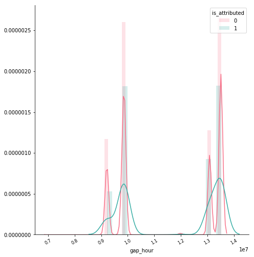
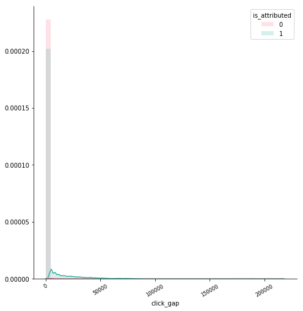
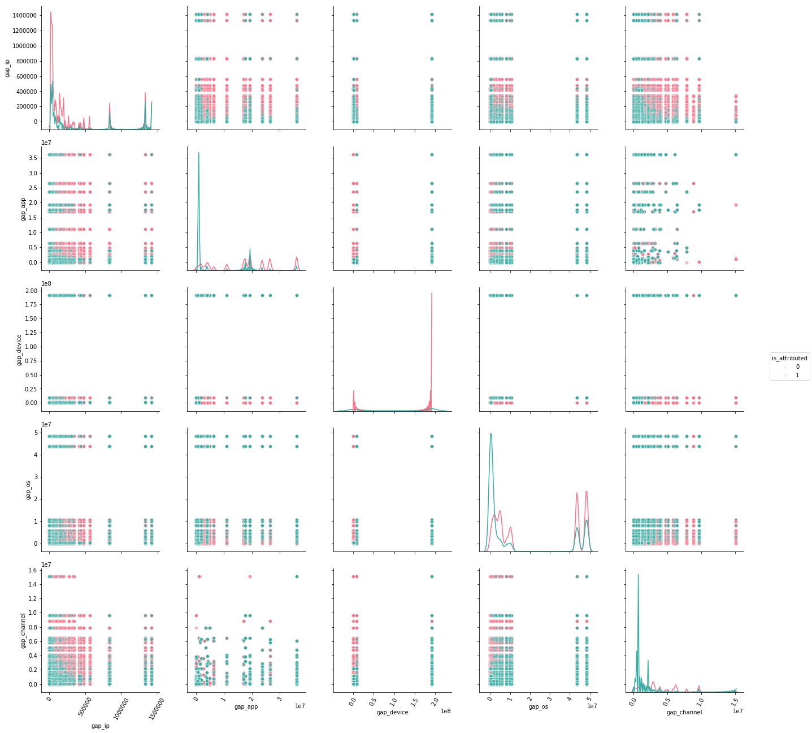
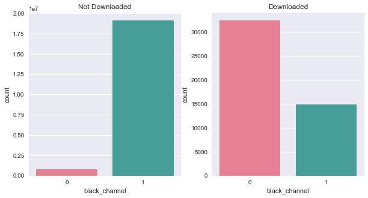

##### TalkingData AdTracking Fraud Detection Challenge
# 3. Sampling
[source code](03_Sampling.py) <br>

Extract a sample and draw graphs.

<br>

---

## Import library

```python
import pandas as pd
import numpy as np

import seaborn as sns
import matplotlib.pyplot as plt

import gc

train_length = 184903890
```

<br>

## Extract samples

```python
train = pd.read_csv('data/merge_add_features.csv')
index = train_length - 50000000
temp = train.iloc[index:]

for n in [40000000,30000000,20000000,10000000]:
    index = train_length - n
    sample = train.iloc[index:]
    print(sample.shape)
    gc.collect()

    m = n / 1000000
    sample.to_csv('data/train_add_features_' + str(m) + 'm.csv', index=False)

    del sample
```

> Extract the most recent data because it is time series data.

<br>

---

## Draw dirstribution of sample

```python
def dist(a):
    df = pd.read_csv('data/train_add_features_20m.csv', usecols=[a, 'is_attributed'])

    g =  sns.FacetGrid(df, hue='is_attributed', size=7, palette='husl')
    g = g.map(sns.distplot, a, hist_kws={'alpha':0.2})

    plt.xticks(rotation=30, fontsize="small")
    plt.legend(loc='upper right').set_title('is_attributed')
    plt.savefig('graph/dist_' + a + '_20m.png', bbox_inches='tight')
    plt.show()
    gc.collect()
```

```python
dist('gap_ip')
```


```python
dist('rate_ip')
```


```python
dist('gap_app')
```


```python
dist('rate_app')
```


```python
dist('gap_device')
```


```python
dist('rate_device')
```


```python
dist('gap_os')
```


```python
dist('rate_os')
```


```python
dist('gap_channel')
```


```python
dist('rate_channel')
```


```python
dist('gap_hour')
```



```python
dist('rate_hour')
```


```python
dist('click_gap')
```



<br>

## Draw a scatter plot of sample

```python
def scatter(feat):
    x = pd.read_csv('data/train_add_features_20m.csv', usecols=feat+['is_attributed'])

    g = sns.pairplot(x,
                     vars=feat,
                     hue='is_attributed',
                     diag_kind="kde",
                     palette="husl",
                     plot_kws={'alpha':0.1})

    for ax in g.axes.flat:
        for label in ax.get_xticklabels():
            label.set_rotation(60)

    g.fig.set_size_inches(20,18)
    plt.savefig('graph/scatter_20m.png', bbox_inches='tight')
    plt.show()
    gc.collect()
```

```python
scatter(['gap_ip', 'gap_app', 'gap_device', 'gap_os', 'gap_channel'])
```



<br>

## Draw bar graphs of sample

```python
def bar(x):
    df = pd.read_csv('data/train_add_features_20m.csv', usecols=[x, 'is_attributed'])

    sns.set(rc={'figure.figsize':(10,5)})

    temp = df.loc[df['is_attributed'] == 0]
    plt.subplot(1,2,1)
    plt.title('Not Downloaded')
    sns.countplot(x, data=temp, linewidth=0, palette='husl')

    temp = df.loc[df['is_attributed'] == 1]
    plt.subplot(1,2,2)
    plt.title('Downloaded')
    sns.countplot(x, data=temp, linewidth=0, palette='husl')

    plt.savefig('graph/bar_' + x + '_20m.png', bbox_inches='tight')
    plt.show()
    gc.collect()
```

```python
bar('black_ip')
```


```python
bar('black_app')
```


```python
bar('black_device')
```


```python
bar('black_os')
```


```python
bar('black_channel')
```



```python
bar('black_hour')
```


<br>

## Draw a bar graph of 'click_gap' and 'is_attributed'

```python
train = pd.read_csv('data/train_add_features_20m.csv', usecols=['click_gap', 'is_attributed'])

sns.set(rc={'figure.figsize':(15,12)})

temp = train.loc[train['is_attributed'] == 0]
plt.subplot(2,1,1)
plt.title('Not Downloaded')
sns.countplot('click_gap', data=temp, linewidth=0)
plt.xlim((-1,20))

temp = train.loc[train['is_attributed'] == 1]
plt.subplot(2,1,2)
plt.title('Downloaded')
sns.countplot('click_gap', data=temp, linewidth=0)
plt.xlim((-1,20))

plt.savefig('graph/bar_click_gap_20m.png', bbox_inches='tight')
plt.show()
gc.collect()
```


<br>

## Check correlation

```python
train = pd.read_csv('data/train_add_features_20m.csv')
corr = train.corr(method='pearson')
corr = corr.round(2)
mask = np.zeros_like(corr, dtype=np.bool)
mask[np.triu_indices_from(mask)] = True
cmap = sns.diverging_palette(220, 10, as_cmap=True)

sns.set(rc={'figure.figsize':(20,18)})
sns.heatmap(corr, vmin=-1, vmax=1,
            mask=mask, cmap=cmap, annot=True, linewidth=.5, cbar_kws={'shrink':.6})
plt.savefig('graph/heatmap_20m.png', bbox_inches='tight')
plt.show()
gc.collect()
```


<br>

---

[Contents](README.md) <br>
[2. Preprocessing](02_Preprocessing.md) <br>
[4. Modeling](04_Modeling.md)
