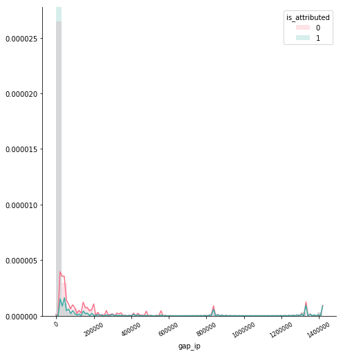
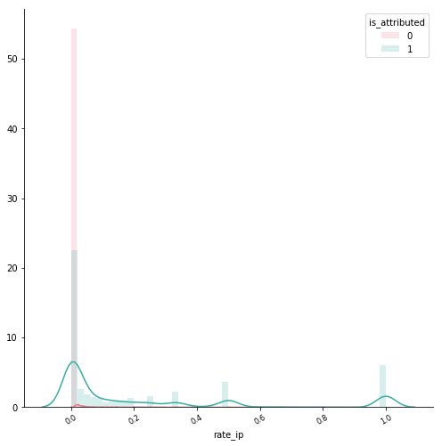
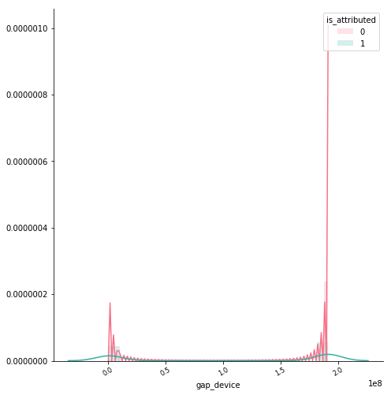
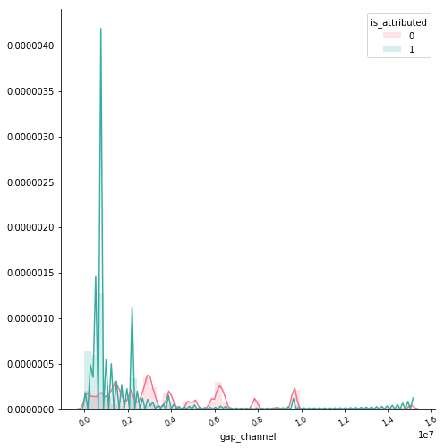
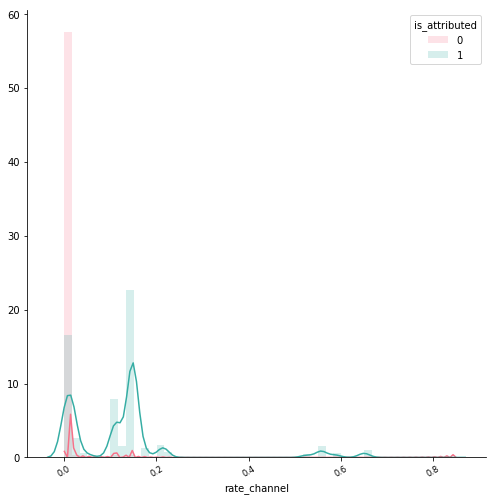
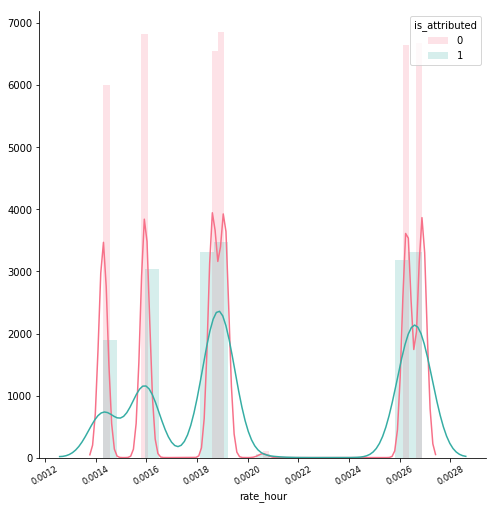
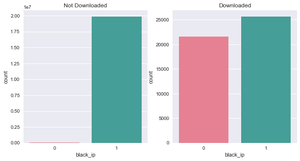
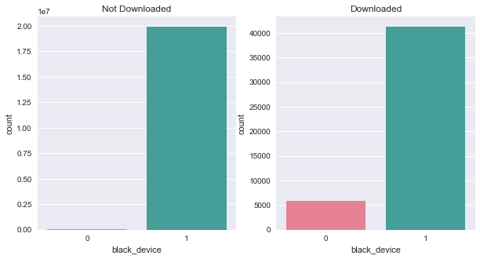
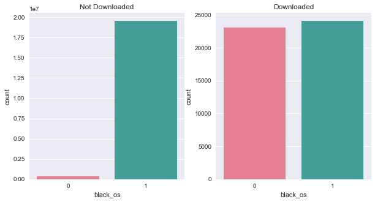

##### TalkingData AdTracking Fraud Detection Challenge
# sample graphs

Draw graphs to see if the sample data and the all data distribution are similar.

<br>

---

## Draw distribution of sample

* gap_ip



<br>

* rate_ip



<br>

* gap_app


<br>

* rate_app


<br>

* gap_device



<br>

* rate_device


<br>

* gap_os


<br>

* rate_os


<br>

* gap_channel



<br>

* rate_channel



<br>

* gap_hour


<br>

* rate_hour



<br>

## Draw bar graphs of sample

* black_ip



<br>

* black_app


<br>

* black_device


<br>

* black_os


<br>

* black_channel


<br>

* black_hour


<br>

## Draw a bar graph of feature 'click_gap'

```python
train = pd.read_csv('data/train_add_features_20m.csv', usecols=['click_gap', 'is_attributed'])

sns.set(rc={'figure.figsize':(15,12)})

temp = train.loc[train['is_attributed'] == 0]
plt.subplot(2,1,1)
plt.title('Not Downloaded')
sns.countplot('click_gap', data=temp, linewidth=0)
plt.xlim((-1,20))

temp = train.loc[train['is_attributed'] == 1]
plt.subplot(2,1,2)
plt.title('Downloaded')
sns.countplot('click_gap', data=temp, linewidth=0)
plt.xlim((-1,20))

plt.savefig('graph/bar_click_gap_20m.png', bbox_inches='tight')
plt.show()
gc.collect()
```


<br>

## Check correlation

```python
train = pd.read_csv('data/train_add_features_20m.csv')
corr = train.corr(method='pearson')
corr = corr.round(2)
mask = np.zeros_like(corr, dtype=np.bool)
mask[np.triu_indices_from(mask)] = True
cmap = sns.diverging_palette(220, 10, as_cmap=True)

sns.set(rc={'figure.figsize':(20,18)})
sns.heatmap(corr, vmin=-1, vmax=1,
            mask=mask, cmap=cmap, annot=True, linewidth=.5, cbar_kws={'shrink':.6})
plt.savefig('graph/heatmap_20m.png', bbox_inches='tight')
plt.show()
gc.collect()
```


---

[Contents](README.md) <br>
[3. Sampling](03_Sampling.md) <br>
[4. Modeling](04_Modeling.md)
