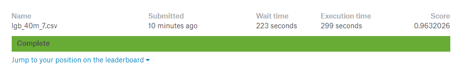
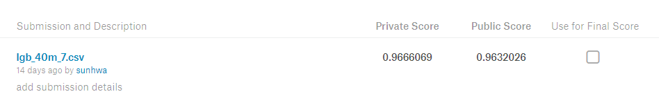

##### TalkingData AdTracking Fraud Detection Challenge
# 5. Conclusion

At first, I thought I could tell whether or not this is a fraudulent click by ip, app and channel. But factor levels are too large. So I made the download rate per features(ip, app, device, os, channel and hour) to represent the characteristics of those factors and then, made models with made features. But it bacame **overfitting** by the download rate per ip.

 

To slove this problem, I've made blacklist of ip, app, os, device, channel, hour that is many clicks but not many downloads. I also extracted click time for each ip and calculated the click gap. As a result, I made **good models** without overfitting.

 

I thought only features related to ip, app, channel and click time were important, but the performance of the added model with features related to device and os was better. Performance was better when sampling recent data than random sampling. Also, there was **less overfitting** when sampling recent data.

 

Performance was different depending on machine learning methods and the used features. The machine learning method provided the best performance is **LightGBM**. The used features are **rate_app, rate_channel, rate_hour, gap_app, gap_device, gap_os, gap_channel, black_ip, click_gap**. The Train size provided the best performance is **40,000,000**. I felt sad because I could not compare performance more closely by checking the time.

 

  

 

---

[Contents](README.md)  
[Excel](performance.xlsx)
