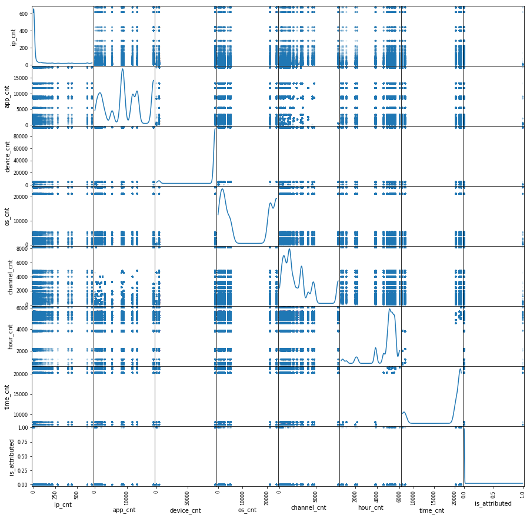
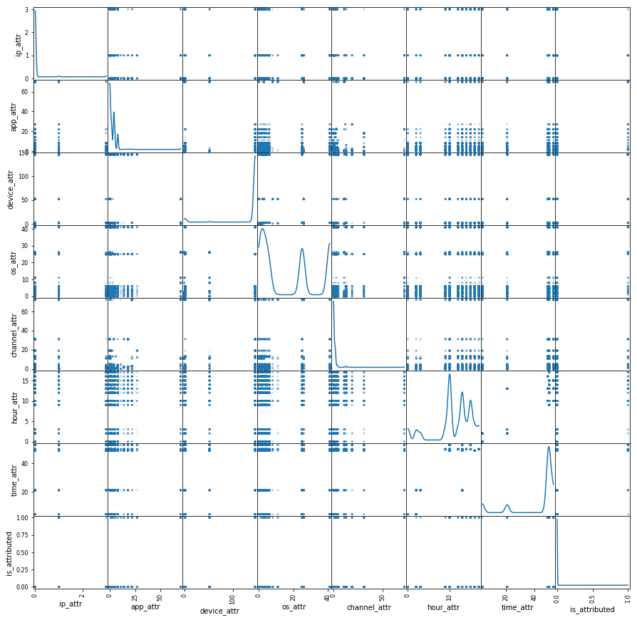
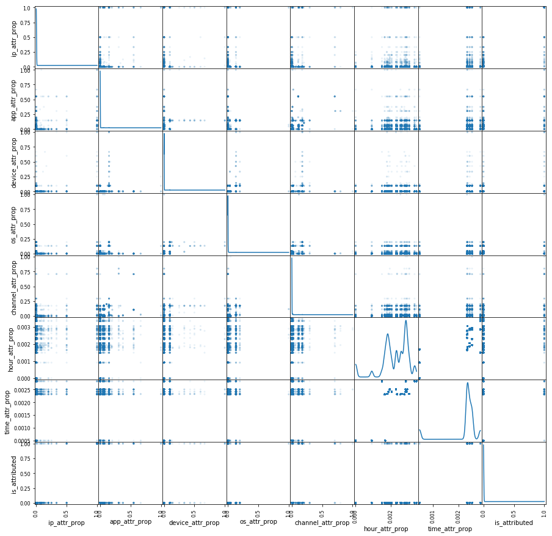
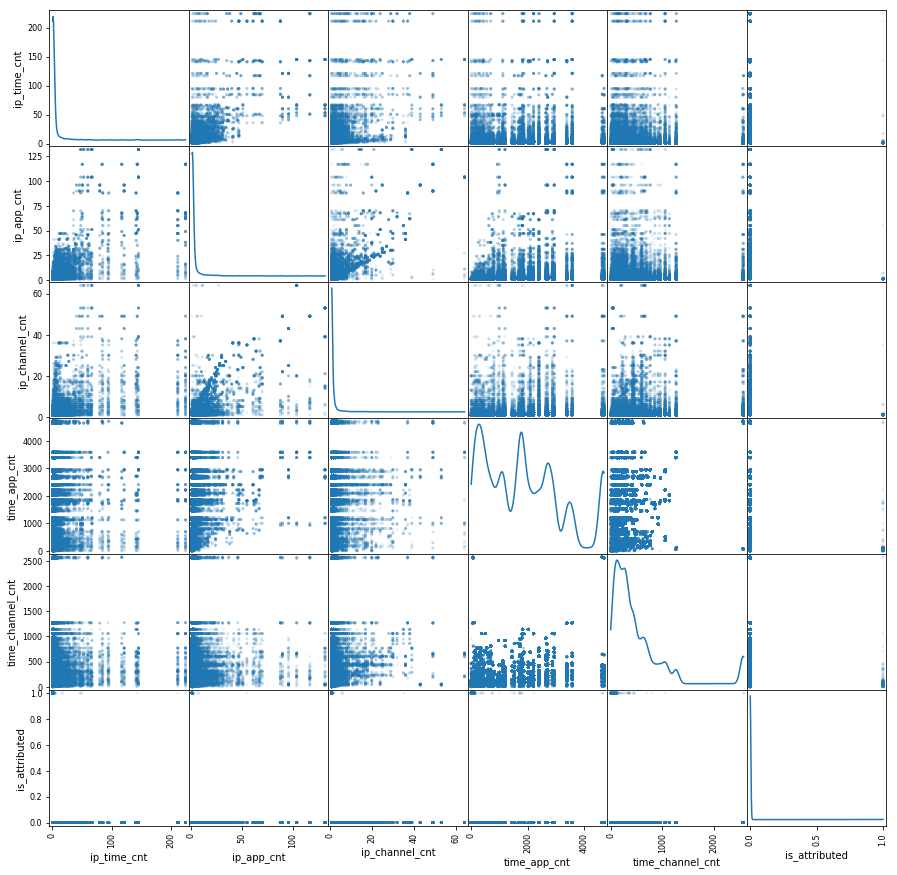
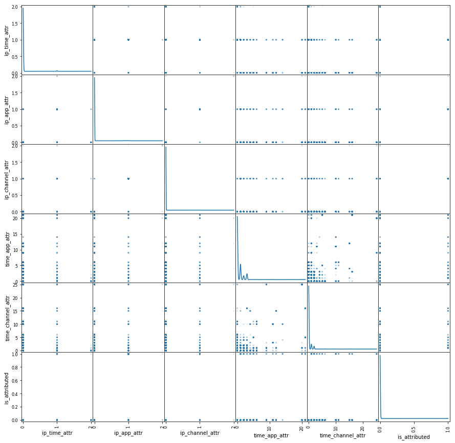
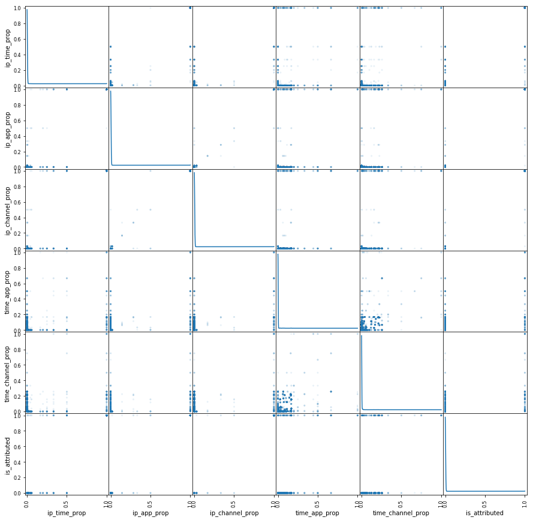

# 2. Train Data Preprocessing

### Import library and data


```python
import pandas as pd
import numpy as np
%matplotlib inline

ad = pd.read_csv("train_sample.csv", parse_dates=['click_time'])
```

### Check data


```python
print(ad.shape)
print(ad.columns)
```

    (100000, 8)
    Index(['ip', 'app', 'device', 'os', 'channel', 'click_time', 'attributed_time',
           'is_attributed'],
          dtype='object')
    

### Make derived variables : hour, time


```python
ad['hour'] = np.nan
ad['hour'] = ad['click_time'].dt.hour

ad['time'] = np.nan
ad['time'] = ad['hour'] // 4

print(ad[['click_time','hour','time']].head(20))
```

                click_time  hour  time
    0  2017-11-07 09:30:38     9     2
    1  2017-11-07 13:40:27    13     3
    2  2017-11-07 18:05:24    18     4
    3  2017-11-07 04:58:08     4     1
    4  2017-11-09 09:00:09     9     2
    5  2017-11-09 01:22:13     1     0
    6  2017-11-09 01:17:58     1     0
    7  2017-11-07 10:01:53    10     2
    8  2017-11-08 09:35:17     9     2
    9  2017-11-08 12:35:26    12     3
    10 2017-11-08 08:14:37     8     2
    11 2017-11-07 05:03:14     5     1
    12 2017-11-09 10:24:23    10     2
    13 2017-11-08 14:46:16    14     3
    14 2017-11-07 00:54:09     0     0
    15 2017-11-08 23:17:45    23     5
    16 2017-11-09 07:33:41     7     1
    17 2017-11-09 03:44:35     3     0
    18 2017-11-06 23:14:08    23     5
    19 2017-11-06 20:07:00    20     5
    

### Remove variables : click_time, attributed_time


```python
del ad['click_time']
del ad['attributed_time']
```

### Make derived variables

* 'v'_cnt : frequency by 'v'
* 'v'_attr : the number of download by 'v'
* 'v'_attr_prop : the proporation of download by 'v'
* tot_attr_prop : the total of 'v'_attr_prop


```python
var = ['ip','app','device','os','channel','hour','time']
var1 = ['ip_cnt','app_cnt','device_cnt','os_cnt','channel_cnt','hour_cnt','time_cnt']
var2 = ['ip_attr','app_attr','device_attr','os_attr','channel_attr','hour_attr','time_attr']
var3 = ['ip_attr_prop','app_attr_prop','device_attr_prop','os_attr_prop',
        'channel_attr_prop','hour_attr_prop','time_attr_prop']

for v,v1,v2,v3 in zip(var,var1,var2,var3):
    temp = ad[v].value_counts().reset_index(name='counts')
    temp.columns = [v,v1]
    ad = ad.merge(temp, on=v, how='left')

    temp = ad.groupby(v)['is_attributed'].sum().reset_index(name='counts')
    temp.columns = [v,v2]
    ad = ad.merge(temp, on=v, how='left')

    ad[v3] = np.nan
    ad[v3] = ad[v2] / ad[v1]
    
    print(ad[[v,v1,v2,v3]].head(20))
```

            ip  ip_cnt  ip_attr  ip_attr_prop
    0    87540       8        0       0.00000
    1   105560     149        0       0.00000
    2   101424       2        0       0.00000
    3    94584       3        0       0.00000
    4    68413       4        0       0.00000
    5    93663       2        0       0.00000
    6    17059       8        0       0.00000
    7   121505       5        0       0.00000
    8   192967       5        0       0.00000
    9   143636       1        0       0.00000
    10   73839      25        0       0.00000
    11   34812      11        0       0.00000
    12  114809       3        0       0.00000
    13  114220      95        0       0.00000
    14   36150      52        0       0.00000
    15   72116       1        0       0.00000
    16    5314     616        3       0.00487
    17  106598      21        0       0.00000
    18   72065       3        0       0.00000
    19   37301       4        0       0.00000
        app  app_cnt  app_attr  app_attr_prop
    0    12    13198         1       0.000076
    1    25      804         0       0.000000
    2    12    13198         1       0.000076
    3    13     2422         0       0.000000
    4    12    13198         1       0.000076
    5     3    18279         4       0.000219
    6     1     3135         0       0.000000
    7     9     8992         8       0.000890
    8     2    11737         0       0.000000
    9     3    18279         4       0.000219
    10    3    18279         4       0.000219
    11    3    18279         4       0.000219
    12    3    18279         4       0.000219
    13    6     1303         0       0.000000
    14    2    11737         0       0.000000
    15   25      804         0       0.000000
    16    2    11737         0       0.000000
    17    3    18279         4       0.000219
    18   20      911         1       0.001098
    19   14     5359         0       0.000000
        device  device_cnt  device_attr  device_attr_prop
    0        1       94338          146          0.001548
    1        1       94338          146          0.001548
    2        1       94338          146          0.001548
    3        1       94338          146          0.001548
    4        1       94338          146          0.001548
    5        1       94338          146          0.001548
    6        1       94338          146          0.001548
    7        1       94338          146          0.001548
    8        2        4345            2          0.000460
    9        1       94338          146          0.001548
    10       1       94338          146          0.001548
    11       1       94338          146          0.001548
    12       1       94338          146          0.001548
    13       1       94338          146          0.001548
    14       1       94338          146          0.001548
    15       2        4345            2          0.000460
    16       1       94338          146          0.001548
    17       1       94338          146          0.001548
    18       2        4345            2          0.000460
    19       1       94338          146          0.001548
        os  os_cnt  os_attr  os_attr_prop
    0   13   21223       25      0.001178
    1   17    5232        6      0.001147
    2   19   23870       41      0.001718
    3   13   21223       25      0.001178
    4    1    1185        1      0.000844
    5   17    5232        6      0.001147
    6   17    5232        6      0.001147
    7   25    2248        5      0.002224
    8   22    4039        6      0.001486
    9   19   23870       41      0.001718
    10  22    4039        6      0.001486
    11  13   21223       25      0.001178
    12  22    4039        6      0.001486
    13  20    2347        3      0.001278
    14  13   21223       25      0.001178
    15  19   23870       41      0.001718
    16   2     397        1      0.002519
    17  20    2347        3      0.001278
    18  90      15        0      0.000000
    19  13   21223       25      0.001178
        channel  channel_cnt  channel_attr  channel_attr_prop
    0       497          238             0           0.000000
    1       259         3130             0           0.000000
    2       212          635             0           0.000000
    3       477         3960             0           0.000000
    4       178         2936             0           0.000000
    5       115          776             0           0.000000
    6       135         1473             0           0.000000
    7       442         1941             1           0.000515
    8       364          336             0           0.000000
    9       135         1473             0           0.000000
    10      489         1426             2           0.001403
    11      489         1426             2           0.001403
    12      205         2369             0           0.000000
    13      125          649             0           0.000000
    14      205         2369             0           0.000000
    15      259         3130             0           0.000000
    16      477         3960             0           0.000000
    17      280         8114             2           0.000246
    18      259         3130             0           0.000000
    19      349          584             0           0.000000
        hour  hour_cnt  hour_attr  hour_attr_prop
    0      9      4867         10        0.002055
    1     13      5619         10        0.001780
    2     18      1183          2        0.001691
    3      4      6039         10        0.001656
    4      9      4867         10        0.002055
    5      1      5103         15        0.002939
    6      1      5103         15        0.002939
    7     10      5511         16        0.002903
    8      9      4867         10        0.002055
    9     12      5326         14        0.002629
    10     8      4576         13        0.002841
    11     5      5400         15        0.002778
    12    10      5511         16        0.002903
    13    14      5561         17        0.003057
    14     0      5654         13        0.002299
    15    23      3870         13        0.003359
    16     7      5089         13        0.002555
    17     3      5264         15        0.002850
    18    23      3870         13        0.003359
    19    20       699          2        0.002861
        time  time_cnt  time_attr  time_attr_prop
    0      2     20296         49        0.002414
    1      3     21463         50        0.002330
    2      4      8041          4        0.000497
    3      1     21607         50        0.002314
    4      2     20296         49        0.002414
    5      0     21158         53        0.002505
    6      0     21158         53        0.002505
    7      2     20296         49        0.002414
    8      2     20296         49        0.002414
    9      3     21463         50        0.002330
    10     2     20296         49        0.002414
    11     1     21607         50        0.002314
    12     2     20296         49        0.002414
    13     3     21463         50        0.002330
    14     0     21158         53        0.002505
    15     5      7435         21        0.002824
    16     1     21607         50        0.002314
    17     0     21158         53        0.002505
    18     5      7435         21        0.002824
    19     5      7435         21        0.002824
    


```python
ad['tot_attr_prop'] = np.nan
ad['tot_attr_prop'] = ad[var3].sum(axis=1)
print(ad['tot_attr_prop'].head(20))
```

    0     0.007270
    1     0.006804
    2     0.005529
    3     0.006696
    4     0.006936
    5     0.008358
    6     0.008139
    7     0.010494
    8     0.006415
    9     0.008442
    10    0.009910
    11    0.009439
    12    0.008570
    13    0.008212
    14    0.007530
    15    0.008362
    16    0.013805
    17    0.008646
    18    0.007742
    19    0.008411
    Name: tot_attr_prop, dtype: float64
    

* 'v'_'vv'_cnt : frequency by 'v' and 'vv'
* 'v'_'vv'_attr : the number of download by 'v' and 'vv'
* 'v'_'vv'_prop : the proporation of download by 'v' and 'vv'
* tot_vv_prop : the total of 'v'_'vv'_prop


```python
var4 = ['ip_time_cnt','ip_app_cnt','ip_channel_cnt','time_app_cnt','time_channel_cnt']
var5 = ['ip_time_attr','ip_app_attr','ip_channel_attr','time_app_attr','time_channel_attr']
var6 = ['ip_time_prop','ip_app_prop','ip_channel_prop','time_app_prop','time_channel_prop']

for v in ['ip','time']:
    if v == 'time':
        v1 = ['app','channel']
    else:
        v1 = ['time','app','channel']
    
    for vv in v1:
        cnt = v+'_'+vv+'_cnt'
        attr =  v+'_'+vv+'_attr'
        prop = v+'_'+vv+'_prop'
        
        temp = ad.groupby([v,vv])['is_attributed'].count().reset_index(name='counts')
        temp.columns = [v,vv,cnt]
        ad = ad.merge(temp, on=[v,vv], how='left')
        
        temp = ad.groupby([v,vv])['is_attributed'].sum().reset_index(name='counts')
        temp.columns = [v,vv,attr]
        ad = ad.merge(temp, on=[v,vv], how='left')
        
        ad[prop]= np.nan
        ad[prop] = ad[attr] / ad[cnt]
        
        print(ad[[v,vv,cnt,attr,prop]].head(20))
```

            ip  time  ip_time_cnt  ip_time_attr  ip_time_prop
    0    87540     2            2             0           0.0
    1   105560     3           42             0           0.0
    2   101424     4            1             0           0.0
    3    94584     1            1             0           0.0
    4    68413     2            2             0           0.0
    5    93663     0            1             0           0.0
    6    17059     0            2             0           0.0
    7   121505     2            2             0           0.0
    8   192967     2            2             0           0.0
    9   143636     3            1             0           0.0
    10   73839     2            2             0           0.0
    11   34812     1            3             0           0.0
    12  114809     2            1             0           0.0
    13  114220     3           26             0           0.0
    14   36150     0            6             0           0.0
    15   72116     5            1             0           0.0
    16    5314     1           85             0           0.0
    17  106598     0            5             0           0.0
    18   72065     5            1             0           0.0
    19   37301     5            1             0           0.0
            ip  app  ip_app_cnt  ip_app_attr  ip_app_prop
    0    87540   12           3            0          0.0
    1   105560   25           4            0          0.0
    2   101424   12           1            0          0.0
    3    94584   13           1            0          0.0
    4    68413   12           2            0          0.0
    5    93663    3           1            0          0.0
    6    17059    1           1            0          0.0
    7   121505    9           2            0          0.0
    8   192967    2           5            0          0.0
    9   143636    3           1            0          0.0
    10   73839    3           9            0          0.0
    11   34812    3           2            0          0.0
    12  114809    3           3            0          0.0
    13  114220    6           3            0          0.0
    14   36150    2          30            0          0.0
    15   72116   25           1            0          0.0
    16    5314    2          61            0          0.0
    17  106598    3           6            0          0.0
    18   72065   20           1            0          0.0
    19   37301   14           2            0          0.0
            ip  channel  ip_channel_cnt  ip_channel_attr  ip_channel_prop
    0    87540      497               1                0              0.0
    1   105560      259               7                0              0.0
    2   101424      212               1                0              0.0
    3    94584      477               1                0              0.0
    4    68413      178               1                0              0.0
    5    93663      115               1                0              0.0
    6    17059      135               1                0              0.0
    7   121505      442               1                0              0.0
    8   192967      364               5                0              0.0
    9   143636      135               1                0              0.0
    10   73839      489               1                0              0.0
    11   34812      489               2                0              0.0
    12  114809      205               1                0              0.0
    13  114220      125               2                0              0.0
    14   36150      205              29                0              0.0
    15   72116      259               1                0              0.0
    16    5314      477              28                0              0.0
    17  106598      280               4                0              0.0
    18   72065      259               1                0              0.0
    19   37301      349               1                0              0.0
        time  app  time_app_cnt  time_app_attr  time_app_prop
    0      2   12          2713              0       0.000000
    1      3   25           190              0       0.000000
    2      4   12          1202              0       0.000000
    3      1   13           503              0       0.000000
    4      2   12          2713              0       0.000000
    5      0    3          4714              1       0.000212
    6      0    1           694              0       0.000000
    7      2    9          2028              0       0.000000
    8      2    2          2099              0       0.000000
    9      3    3          3585              0       0.000000
    10     2    3          3393              0       0.000000
    11     1    3          4651              3       0.000645
    12     2    3          3393              0       0.000000
    13     3    6           274              0       0.000000
    14     0    2          2399              0       0.000000
    15     5   25            59              0       0.000000
    16     1    2          2883              0       0.000000
    17     0    3          4714              1       0.000212
    18     5   20            78              1       0.012821
    19     5   14           463              0       0.000000
        time  channel  time_channel_cnt  time_channel_attr  time_channel_prop
    0      2      497                50                  0                0.0
    1      3      259               765                  0                0.0
    2      4      212                58                  0                0.0
    3      1      477              1057                  0                0.0
    4      2      178               685                  0                0.0
    5      0      115               136                  0                0.0
    6      0      135               311                  0                0.0
    7      2      442               429                  0                0.0
    8      2      364                46                  0                0.0
    9      3      135               312                  0                0.0
    10     2      489               297                  0                0.0
    11     1      489               306                  0                0.0
    12     2      205               450                  0                0.0
    13     3      125               159                  0                0.0
    14     0      205               421                  0                0.0
    15     5      259               284                  0                0.0
    16     1      477              1057                  0                0.0
    17     0      280              2559                  0                0.0
    18     5      259               284                  0                0.0
    19     5      349                69                  0                0.0
    


```python
ad['tot_vv_prop'] = np.nan
ad['tot_vv_prop'] = ad[var6].sum(axis=1)
print(ad['tot_vv_prop'].head(20))
```

    0     0.000000
    1     0.000000
    2     0.000000
    3     0.000000
    4     0.000000
    5     0.000212
    6     0.000000
    7     0.000000
    8     0.000000
    9     0.000000
    10    0.000000
    11    0.000645
    12    0.000000
    13    0.000000
    14    0.000000
    15    0.000000
    16    0.000000
    17    0.000212
    18    0.012821
    19    0.000000
    Name: tot_vv_prop, dtype: float64
    

### Check correlation


```python
feat = var1 + var2 + var3 +var4 +var5 + var6 + ['is_attributed']
```

pearson


```python
print(ad[feat].corr(method='pearson'))
```

                         ip_cnt   app_cnt  device_cnt    os_cnt  channel_cnt  \
    ip_cnt             1.000000 -0.005644   -0.085115 -0.013335    -0.007876   
    app_cnt           -0.005644  1.000000    0.075672  0.019252     0.332709   
    device_cnt        -0.085115  0.075672    1.000000  0.124416     0.031362   
    os_cnt            -0.013335  0.019252    0.124416  1.000000    -0.001913   
    channel_cnt       -0.007876  0.332709    0.031362 -0.001913     1.000000   
    hour_cnt          -0.011222  0.034421    0.011891 -0.001372     0.024710   
    time_cnt          -0.014289  0.042229    0.010723 -0.003778     0.031040   
    ip_attr            0.799699 -0.027097   -0.050141 -0.014987    -0.008288   
    app_attr           0.005776  0.012090   -0.246103 -0.067724    -0.019669   
    device_attr       -0.085724  0.062933    0.992833  0.117300     0.023704   
    os_attr           -0.009940  0.004580    0.090449  0.959895    -0.012703   
    channel_attr       0.004880 -0.143591   -0.206826 -0.059592    -0.034937   
    hour_attr         -0.015428  0.025758    0.014192 -0.002493     0.012104   
    time_attr         -0.016946  0.038477    0.009815 -0.003039     0.023873   
    ip_attr_prop      -0.003119 -0.058399   -0.054815 -0.021161    -0.037670   
    app_attr_prop     -0.001695 -0.148008   -0.148772 -0.042280    -0.089711   
    device_attr_prop   0.004730 -0.081377   -0.208130 -0.057620    -0.050226   
    os_attr_prop       0.010443 -0.105493   -0.266691 -0.076970    -0.066542   
    channel_attr_prop -0.000952 -0.134074   -0.142192 -0.045154    -0.102309   
    hour_attr_prop    -0.013530  0.009980    0.006731 -0.003238    -0.004545   
    time_attr_prop    -0.010338  0.010333   -0.001883 -0.002086    -0.008617   
    ip_time_cnt        0.905759 -0.005033   -0.076403 -0.012013    -0.010562   
    ip_app_cnt         0.769754  0.140529   -0.066540 -0.006641     0.025826   
    ip_channel_cnt     0.638399  0.060410   -0.087211 -0.009459     0.082189   
    time_app_cnt      -0.015507  0.886109    0.070934  0.016265     0.356472   
    time_channel_cnt  -0.017062  0.345988    0.036678  0.000475     0.892430   
    ip_time_attr       0.480314 -0.038418   -0.055449 -0.018360    -0.025315   
    ip_app_attr        0.089096 -0.063700   -0.062634 -0.021473    -0.034977   
    ip_channel_attr    0.063548 -0.064887   -0.063586 -0.021583    -0.034433   
    time_app_attr     -0.009623  0.037391   -0.189382 -0.055277     0.058245   
    time_channel_attr  0.000986 -0.108485   -0.168671 -0.049635     0.002835   
    ip_time_prop      -0.002943 -0.061952   -0.057924 -0.020597    -0.039065   
    ip_app_prop       -0.002737 -0.067656   -0.065314 -0.020555    -0.042743   
    ip_channel_prop   -0.002726 -0.067287   -0.064754 -0.020448    -0.042805   
    time_app_prop     -0.002348 -0.133355   -0.133359 -0.035869    -0.080085   
    time_channel_prop -0.001284 -0.119696   -0.123468 -0.039632    -0.089339   
    is_attributed     -0.002698 -0.066689   -0.064344 -0.019520    -0.042364   
    
                       hour_cnt  time_cnt   ip_attr  app_attr  device_attr  \
    ip_cnt            -0.011222 -0.014289  0.799699  0.005776    -0.085724   
    app_cnt            0.034421  0.042229 -0.027097  0.012090     0.062933   
    device_cnt         0.011891  0.010723 -0.050141 -0.246103     0.992833   
    os_cnt            -0.001372 -0.003778 -0.014987 -0.067724     0.117300   
    channel_cnt        0.024710  0.031040 -0.008288 -0.019669     0.023704   
    hour_cnt           1.000000  0.860343  0.004670  0.013943     0.011959   
    time_cnt           0.860343  1.000000  0.004605  0.013977     0.010920   
    ip_attr            0.004670  0.004605  1.000000  0.038015    -0.047214   
    app_attr           0.013943  0.013977  0.038015  1.000000    -0.178473   
    device_attr        0.011959  0.010920 -0.047214 -0.178473     1.000000   
    os_attr           -0.001510 -0.003509 -0.009701  0.001621     0.092973   
    channel_attr       0.018323  0.024119  0.044034  0.579352    -0.158526   
    hour_attr          0.700498  0.692154  0.003472  0.014324     0.014862   
    time_attr          0.831983  0.959925  0.004292  0.015476     0.010241   
    ip_attr_prop       0.004128  0.006867  0.159086  0.201531    -0.040854   
    app_attr_prop      0.007548  0.008794  0.062237  0.532046    -0.106700   
    device_attr_prop   0.003459  0.005014  0.046735  0.479669    -0.152676   
    os_attr_prop       0.001917  0.004696  0.044640  0.573389    -0.192370   
    channel_attr_prop  0.008072  0.010693  0.057625  0.439926    -0.108547   
    hour_attr_prop     0.280334  0.353991  0.001132  0.010663     0.007629   
    time_attr_prop     0.444083  0.488721  0.005503  0.013910    -0.001084   
    ip_time_cnt        0.050606  0.055296  0.744235  0.007972    -0.077393   
    ip_app_cnt        -0.014801 -0.017519  0.497746 -0.008604    -0.071195   
    ip_channel_cnt    -0.023511 -0.023360  0.404191 -0.027473    -0.090629   
    time_app_cnt       0.318618  0.372214 -0.024423  0.021969     0.060437   
    time_channel_cnt   0.188067  0.221179 -0.010767  0.003160     0.030964   
    ip_time_attr      -0.000961 -0.000331  0.658336  0.109250    -0.047376   
    ip_app_attr        0.004160  0.005808  0.228313  0.238842    -0.046314   
    ip_channel_attr    0.004078  0.005310  0.201201  0.240147    -0.047629   
    time_app_attr      0.091541  0.100082  0.029399  0.804600    -0.134068   
    time_channel_attr  0.057805  0.067419  0.042553  0.500762    -0.127977   
    ip_time_prop       0.003243  0.006059  0.150131  0.214070    -0.043058   
    ip_app_prop        0.003904  0.005910  0.139628  0.243204    -0.048047   
    ip_channel_prop    0.004193  0.006031  0.139062  0.241288    -0.047715   
    time_app_prop      0.010053  0.011108  0.068873  0.479372    -0.095773   
    time_channel_prop  0.008984  0.011714  0.066760  0.398994    -0.093711   
    is_attributed      0.004399  0.005555  0.137631  0.239725    -0.047201   
    
                           ...        ip_app_attr  ip_channel_attr  time_app_attr  \
    ip_cnt                 ...           0.089096         0.063548      -0.009623   
    app_cnt                ...          -0.063700        -0.064887       0.037391   
    device_cnt             ...          -0.062634        -0.063586      -0.189382   
    os_cnt                 ...          -0.021473        -0.021583      -0.055277   
    channel_cnt            ...          -0.034977        -0.034433       0.058245   
    hour_cnt               ...           0.004160         0.004078       0.091541   
    time_cnt               ...           0.005808         0.005310       0.100082   
    ip_attr                ...           0.228313         0.201201       0.029399   
    app_attr               ...           0.238842         0.240147       0.804600   
    device_attr            ...          -0.046314        -0.047629      -0.134068   
    os_attr                ...           0.001471         0.002067       0.002196   
    channel_attr           ...           0.257767         0.273522       0.482733   
    hour_attr              ...           0.010553         0.010744       0.088074   
    time_attr              ...           0.007814         0.007229       0.109143   
    ip_attr_prop           ...           0.731075         0.764890       0.200397   
    app_attr_prop          ...           0.398309         0.412722       0.460595   
    device_attr_prop       ...           0.269324         0.277863       0.403219   
    os_attr_prop           ...           0.233349         0.240219       0.479851   
    channel_attr_prop      ...           0.364061         0.384429       0.366943   
    hour_attr_prop         ...           0.012110         0.011942       0.064702   
    time_attr_prop         ...           0.010652         0.009282       0.086834   
    ip_time_cnt            ...           0.089563         0.058477      -0.010798   
    ip_app_cnt             ...           0.038958         0.022216      -0.021437   
    ip_channel_cnt         ...           0.046228         0.046050      -0.026722   
    time_app_cnt           ...          -0.053573        -0.054582       0.119400   
    time_channel_cnt       ...          -0.027495        -0.026705       0.145986   
    ip_time_attr           ...           0.440101         0.421185       0.095505   
    ip_app_attr            ...           1.000000         0.917336       0.232108   
    ip_channel_attr        ...           0.917336         1.000000       0.233882   
    time_app_attr          ...           0.232108         0.233882       1.000000   
    time_channel_attr      ...           0.262565         0.278147       0.559240   
    ip_time_prop           ...           0.774199         0.810274       0.210159   
    ip_app_prop            ...           0.861621         0.888459       0.238879   
    ip_channel_prop        ...           0.854135         0.899998       0.237263   
    time_app_prop          ...           0.439078         0.456331       0.471492   
    time_channel_prop      ...           0.415140         0.437424       0.369637   
    is_attributed          ...           0.849294         0.890735       0.235784   
    
                       time_channel_attr  ip_time_prop  ip_app_prop  \
    ip_cnt                      0.000986     -0.002943    -0.002737   
    app_cnt                    -0.108485     -0.061952    -0.067656   
    device_cnt                 -0.168671     -0.057924    -0.065314   
    os_cnt                     -0.049635     -0.020597    -0.020555   
    channel_cnt                 0.002835     -0.039065    -0.042743   
    hour_cnt                    0.057805      0.003243     0.003904   
    time_cnt                    0.067419      0.006059     0.005910   
    ip_attr                     0.042553      0.150131     0.139628   
    app_attr                    0.500762      0.214070     0.243204   
    device_attr                -0.127977     -0.043058    -0.048047   
    os_attr                    -0.002829      0.001806     0.004117   
    channel_attr                0.861000      0.256580     0.279115   
    hour_attr                   0.049720      0.013267     0.012311   
    time_attr                   0.063840      0.008766     0.008256   
    ip_attr_prop                0.258014      0.943708     0.877690   
    app_attr_prop               0.377929      0.412851     0.457112   
    device_attr_prop            0.364585      0.280831     0.311665   
    os_attr_prop                0.411933      0.241609     0.256864   
    channel_attr_prop           0.571203      0.384976     0.418685   
    hour_attr_prop              0.032380      0.017001     0.014715   
    time_attr_prop              0.041129      0.012398     0.011117   
    ip_time_cnt                 0.004537     -0.003110    -0.002540   
    ip_app_cnt                 -0.024704     -0.005465    -0.010235   
    ip_channel_cnt             -0.013375     -0.006404    -0.008694   
    time_app_cnt               -0.056064     -0.052110    -0.056899   
    time_channel_cnt            0.070466     -0.029564    -0.032715   
    ip_time_attr                0.121265      0.475141     0.434699   
    ip_app_attr                 0.262565      0.774199     0.861621   
    ip_channel_attr             0.278147      0.810274     0.888459   
    time_app_attr               0.559240      0.210159     0.238879   
    time_channel_attr           1.000000      0.262851     0.282706   
    ip_time_prop                0.262851      1.000000     0.926742   
    ip_app_prop                 0.282706      0.926742     1.000000   
    ip_channel_prop             0.283221      0.926018     0.994578   
    time_app_prop               0.375757      0.453134     0.506896   
    time_channel_prop           0.591573      0.443013     0.479104   
    is_attributed               0.280524      0.916738     0.985693   
    
                       ip_channel_prop  time_app_prop  time_channel_prop  \
    ip_cnt                   -0.002726      -0.002348          -0.001284   
    app_cnt                  -0.067287      -0.133355          -0.119696   
    device_cnt               -0.064754      -0.133359          -0.123468   
    os_cnt                   -0.020448      -0.035869          -0.039632   
    channel_cnt              -0.042805      -0.080085          -0.089339   
    hour_cnt                  0.004193       0.010053           0.008984   
    time_cnt                  0.006031       0.011108           0.011714   
    ip_attr                   0.139062       0.068873           0.066760   
    app_attr                  0.241288       0.479372           0.398994   
    device_attr              -0.047715      -0.095773          -0.093711   
    os_attr                   0.003968       0.005503          -0.003041   
    channel_attr              0.279830       0.383890           0.584036   
    hour_attr                 0.012550       0.015210           0.017592   
    time_attr                 0.008325       0.016070           0.016947   
    ip_attr_prop              0.874130       0.426377           0.424782   
    app_attr_prop             0.454747       0.900998           0.551014   
    device_attr_prop          0.309846       0.272777           0.299570   
    os_attr_prop              0.255538       0.334835           0.324999   
    channel_attr_prop         0.418388       0.518557           0.873222   
    hour_attr_prop            0.014744       0.016827           0.019448   
    time_attr_prop            0.010891       0.022728           0.023969   
    ip_time_cnt              -0.003223      -0.001885          -0.001718   
    ip_app_cnt               -0.009848      -0.020209          -0.018461   
    ip_channel_cnt           -0.008093      -0.016067          -0.015234   
    time_app_cnt             -0.056537      -0.112016          -0.100189   
    time_channel_cnt         -0.032868      -0.061726          -0.068470   
    ip_time_attr              0.433761       0.219224           0.207282   
    ip_app_attr               0.854135       0.439078           0.415140   
    ip_channel_attr           0.899998       0.456331           0.437424   
    time_app_attr             0.237263       0.471492           0.369637   
    time_channel_attr         0.283221       0.375757           0.591573   
    ip_time_prop              0.926018       0.453134           0.443013   
    ip_app_prop               0.994578       0.506896           0.479104   
    ip_channel_prop           1.000000       0.504476           0.478322   
    time_app_prop             0.504476       1.000000           0.574280   
    time_channel_prop         0.478322       0.574280           1.000000   
    is_attributed             0.989708       0.500081           0.474200   
    
                       is_attributed  
    ip_cnt                 -0.002698  
    app_cnt                -0.066689  
    device_cnt             -0.064344  
    os_cnt                 -0.019520  
    channel_cnt            -0.042364  
    hour_cnt                0.004399  
    time_cnt                0.005555  
    ip_attr                 0.137631  
    app_attr                0.239725  
    device_attr            -0.047201  
    os_attr                 0.004791  
    channel_attr            0.276950  
    hour_attr               0.013217  
    time_attr               0.008036  
    ip_attr_prop            0.865133  
    app_attr_prop           0.450572  
    device_attr_prop        0.309155  
    os_attr_prop            0.253601  
    channel_attr_prop       0.414082  
    hour_attr_prop          0.015692  
    time_attr_prop          0.011366  
    ip_time_cnt            -0.002851  
    ip_app_cnt             -0.010089  
    ip_channel_cnt         -0.008010  
    time_app_cnt           -0.056017  
    time_channel_cnt       -0.032469  
    ip_time_attr            0.435579  
    ip_app_attr             0.849294  
    ip_channel_attr         0.890735  
    time_app_attr           0.235784  
    time_channel_attr       0.280524  
    ip_time_prop            0.916738  
    ip_app_prop             0.985693  
    ip_channel_prop         0.989708  
    time_app_prop           0.500081  
    time_channel_prop       0.474200  
    is_attributed           1.000000  
    
    [37 rows x 37 columns]
    

spearman


```python
print(ad[feat].corr(method='spearman'))
```

                         ip_cnt   app_cnt  device_cnt    os_cnt  channel_cnt  \
    ip_cnt             1.000000  0.018993   -0.112039 -0.013195    -0.002340   
    app_cnt            0.018993  1.000000    0.076675  0.038165     0.171119   
    device_cnt        -0.112039  0.076675    1.000000  0.170788     0.039300   
    os_cnt            -0.013195  0.038165    0.170788  1.000000     0.012254   
    channel_cnt       -0.002340  0.171119    0.039300  0.012254     1.000000   
    hour_cnt          -0.006810  0.023574   -0.001061 -0.001695    -0.011743   
    time_cnt          -0.022793  0.042882    0.019431  0.002141     0.015679   
    ip_attr            0.182544 -0.038919   -0.058385 -0.027809    -0.022470   
    app_attr          -0.013113  0.320635   -0.032666 -0.022824     0.107387   
    device_attr       -0.113103  0.073173    0.999554  0.168079     0.036327   
    os_attr           -0.011906  0.009454    0.105114  0.925925    -0.015678   
    channel_attr      -0.008732  0.046199   -0.067571 -0.038327     0.304706   
    hour_attr         -0.025942  0.017226    0.014290  0.000379    -0.006425   
    time_attr         -0.046781  0.055033    0.035681  0.011427     0.016656   
    ip_attr_prop       0.180452 -0.039421   -0.058628 -0.028016    -0.023182   
    app_attr_prop     -0.017623  0.099234   -0.041886 -0.024331     0.041220   
    device_attr_prop  -0.110235 -0.008855    0.779367  0.083062    -0.031652   
    os_attr_prop      -0.003029 -0.022243    0.022305  0.375746    -0.040799   
    channel_attr_prop -0.007873 -0.028376   -0.063260 -0.036318     0.185134   
    hour_attr_prop    -0.018645  0.001716    0.008715 -0.001408    -0.011908   
    time_attr_prop    -0.017884 -0.007723   -0.001214  0.002283    -0.026798   
    ip_time_cnt        0.796449  0.016870   -0.108063 -0.014229    -0.006783   
    ip_app_cnt         0.660137  0.280564   -0.076379 -0.003861     0.051211   
    ip_channel_cnt     0.525588  0.068807   -0.111802 -0.017611     0.184766   
    time_app_cnt       0.005948  0.890052    0.077174  0.031829     0.183870   
    time_channel_cnt  -0.012641  0.172441    0.040521  0.013310     0.912013   
    ip_time_attr       0.108122 -0.042234   -0.056706 -0.028361    -0.033128   
    ip_app_attr       -0.015820 -0.071428   -0.059974 -0.031431    -0.050741   
    ip_channel_attr   -0.024536 -0.070964   -0.062255 -0.032268    -0.052499   
    time_app_attr     -0.034508  0.144535   -0.022117 -0.015068     0.079952   
    time_channel_attr -0.006940 -0.060197   -0.092509 -0.038285     0.070889   
    ip_time_prop       0.107518 -0.042478   -0.056881 -0.028452    -0.033359   
    ip_app_prop       -0.015915 -0.071453   -0.059999 -0.031439    -0.050792   
    ip_channel_prop   -0.024603 -0.070980   -0.062268 -0.032271    -0.052538   
    time_app_prop     -0.031930  0.078886   -0.026629 -0.015110     0.050698   
    time_channel_prop -0.005319 -0.080539   -0.098301 -0.040321     0.044907   
    is_attributed     -0.043385 -0.071115   -0.064950 -0.031148    -0.062522   
    
                       hour_cnt  time_cnt   ip_attr  app_attr  device_attr  \
    ip_cnt            -0.006810 -0.022793  0.182544 -0.013113    -0.113103   
    app_cnt            0.023574  0.042882 -0.038919  0.320635     0.073173   
    device_cnt        -0.001061  0.019431 -0.058385 -0.032666     0.999554   
    os_cnt            -0.001695  0.002141 -0.027809 -0.022824     0.168079   
    channel_cnt       -0.011743  0.015679 -0.022470  0.107387     0.036327   
    hour_cnt           1.000000  0.527968  0.011100  0.017631    -0.001141   
    time_cnt           0.527968  1.000000  0.000518  0.002064     0.019415   
    ip_attr            0.011100  0.000518  1.000000  0.018038    -0.056753   
    app_attr           0.017631  0.002064  0.018038  1.000000    -0.030734   
    device_attr       -0.001141  0.019415 -0.056753 -0.030734     1.000000   
    os_attr           -0.000566  0.000479 -0.009264 -0.010603     0.106621   
    channel_attr       0.034428  0.032842  0.031959  0.396161    -0.063526   
    hour_attr          0.422894  0.261788  0.004264  0.010577     0.014463   
    time_attr          0.521435  0.585090 -0.006195  0.012900     0.035720   
    ip_attr_prop       0.011039  0.000513  0.999769  0.018664    -0.056949   
    app_attr_prop      0.001470 -0.013059  0.023042  0.911597    -0.039862   
    device_attr_prop  -0.000808  0.016361 -0.005689  0.015500     0.797108   
    os_attr_prop       0.000808 -0.003529  0.012157 -0.006062     0.026178   
    channel_attr_prop  0.023240  0.015757  0.034283  0.367560    -0.059114   
    hour_attr_prop     0.038649 -0.022128  0.002437  0.003340     0.008932   
    time_attr_prop    -0.037254 -0.496201  0.001583  0.011077    -0.001064   
    ip_time_cnt        0.084225  0.076007  0.193428 -0.012214    -0.108973   
    ip_app_cnt        -0.002971 -0.010376  0.191199  0.086989    -0.078488   
    ip_channel_cnt    -0.011102 -0.012781  0.225980 -0.007043    -0.113050   
    time_app_cnt       0.245513  0.277807 -0.035448  0.313242     0.073767   
    time_channel_cnt   0.188333  0.227103 -0.020914  0.088510     0.037738   
    ip_time_attr       0.013552  0.004731  0.708082  0.034131    -0.054406   
    ip_app_attr        0.003049  0.002765  0.371093  0.076522    -0.055438   
    ip_channel_attr    0.003439  0.000834  0.354104  0.073654    -0.057653   
    time_app_attr      0.096199  0.121259  0.018252  0.634850    -0.019183   
    time_channel_attr  0.064946  0.126040  0.048215  0.169312    -0.087154   
    ip_time_prop       0.013486  0.004645  0.708031  0.034370    -0.054562   
    ip_app_prop        0.003047  0.002766  0.371088  0.076522    -0.055460   
    ip_channel_prop    0.003436  0.000840  0.354101  0.073653    -0.057664   
    time_app_prop      0.067408  0.075689  0.021892  0.625677    -0.023651   
    time_channel_prop  0.058934  0.108103  0.050594  0.166122    -0.092726   
    is_attributed      0.002873  0.002442  0.321727  0.067374    -0.059985   
    
                           ...        ip_app_attr  ip_channel_attr  time_app_attr  \
    ip_cnt                 ...          -0.015820        -0.024536      -0.034508   
    app_cnt                ...          -0.071428        -0.070964       0.144535   
    device_cnt             ...          -0.059974        -0.062255      -0.022117   
    os_cnt                 ...          -0.031431        -0.032268      -0.015068   
    channel_cnt            ...          -0.050741        -0.052499       0.079952   
    hour_cnt               ...           0.003049         0.003439       0.096199   
    time_cnt               ...           0.002765         0.000834       0.121259   
    ip_attr                ...           0.371093         0.354104       0.018252   
    app_attr               ...           0.076522         0.073654       0.634850   
    device_attr            ...          -0.055438        -0.057653      -0.019183   
    os_attr                ...           0.009421         0.010263       0.001701   
    channel_attr           ...           0.087266         0.088432       0.319874   
    hour_attr              ...           0.008950         0.009857       0.097219   
    time_attr              ...           0.003500         0.003234       0.252063   
    ip_attr_prop           ...           0.378909         0.362467       0.019226   
    app_attr_prop          ...           0.085991         0.084328       0.566055   
    device_attr_prop       ...           0.066703         0.067260       0.045417   
    os_attr_prop           ...           0.040283         0.042859       0.006605   
    channel_attr_prop      ...           0.091266         0.090133       0.283547   
    hour_attr_prop         ...           0.011004         0.011127       0.070246   
    time_attr_prop         ...           0.006114         0.006638       0.108828   
    ip_time_cnt            ...           0.000817        -0.007266      -0.016485   
    ip_app_cnt             ...          -0.001724        -0.010689       0.015669   
    ip_channel_cnt         ...           0.012255         0.003789      -0.018142   
    time_app_cnt           ...          -0.066037        -0.067801       0.194705   
    time_channel_cnt       ...          -0.048518        -0.049875       0.094120   
    ip_time_attr           ...           0.464149         0.448766       0.027846   
    ip_app_attr            ...           1.000000         0.923807       0.092045   
    ip_channel_attr        ...           0.923807         1.000000       0.090126   
    time_app_attr          ...           0.092045         0.090126       1.000000   
    time_channel_attr      ...           0.122757         0.130810       0.354045   
    ip_time_prop           ...           0.467298         0.452189       0.028236   
    ip_app_prop            ...           0.999999         0.924095       0.092071   
    ip_channel_prop        ...           0.923877         0.999999       0.090145   
    time_app_prop          ...           0.100531         0.098914       0.983589   
    time_channel_prop      ...           0.127382         0.135639       0.339544   
    is_attributed          ...           0.870967         0.911624       0.089938   
    
                       time_channel_attr  ip_time_prop  ip_app_prop  \
    ip_cnt                     -0.006940      0.107518    -0.015915   
    app_cnt                    -0.060197     -0.042478    -0.071453   
    device_cnt                 -0.092509     -0.056881    -0.059999   
    os_cnt                     -0.038285     -0.028452    -0.031439   
    channel_cnt                 0.070889     -0.033359    -0.050792   
    hour_cnt                    0.064946      0.013486     0.003047   
    time_cnt                    0.126040      0.004645     0.002766   
    ip_attr                     0.048215      0.708031     0.371088   
    app_attr                    0.169312      0.034370     0.076522   
    device_attr                -0.087154     -0.054562    -0.055460   
    os_attr                    -0.003893     -0.003166     0.009436   
    channel_attr                0.536552      0.042132     0.087295   
    hour_attr                   0.046386      0.011893     0.008960   
    time_attr                   0.062681     -0.008835     0.003507   
    ip_attr_prop                0.049533      0.707358     0.378914   
    app_attr_prop               0.154762      0.041486     0.086007   
    device_attr_prop            0.036910      0.013175     0.066747   
    os_attr_prop                0.023748      0.021362     0.040317   
    channel_attr_prop           0.507255      0.045928     0.091295   
    hour_attr_prop              0.024328      0.015969     0.011014   
    time_attr_prop             -0.034823      0.009312     0.006119   
    ip_time_cnt                 0.010530      0.127581     0.000734   
    ip_app_cnt                 -0.023606      0.120654    -0.001814   
    ip_channel_cnt              0.023748      0.149382     0.012161   
    time_app_cnt               -0.020696     -0.037578    -0.066073   
    time_channel_cnt            0.116372     -0.029074    -0.048565   
    ip_time_attr                0.060865      0.999981     0.464298   
    ip_app_attr                 0.122757      0.467298     0.999999   
    ip_channel_attr             0.130810      0.452189     0.924095   
    time_app_attr               0.354045      0.028236     0.092071   
    time_channel_attr           1.000000      0.061414     0.122834   
    ip_time_prop                0.061414      1.000000     0.467450   
    ip_app_prop                 0.122834      0.467450     1.000000   
    ip_channel_prop             0.130852      0.452325     0.924167   
    time_app_prop               0.341562      0.033625     0.100563   
    time_channel_prop           0.995332      0.064702     0.127462   
    is_attributed               0.136153      0.464111     0.871626   
    
                       ip_channel_prop  time_app_prop  time_channel_prop  \
    ip_cnt                   -0.024603      -0.031930          -0.005319   
    app_cnt                  -0.070980       0.078886          -0.080539   
    device_cnt               -0.062268      -0.026629          -0.098301   
    os_cnt                   -0.032271      -0.015110          -0.040321   
    channel_cnt              -0.052538       0.050698           0.044907   
    hour_cnt                  0.003436       0.067408           0.058934   
    time_cnt                  0.000840       0.075689           0.108103   
    ip_attr                   0.354101       0.021892           0.050594   
    app_attr                  0.073653       0.625677           0.166122   
    device_attr              -0.057664      -0.023651          -0.092726   
    os_attr                   0.010274       0.002828          -0.004239   
    channel_attr              0.088448       0.303124           0.535025   
    hour_attr                 0.009864       0.079314           0.043874   
    time_attr                 0.003240       0.212605           0.058913   
    ip_attr_prop              0.362471       0.022948           0.051951   
    app_attr_prop             0.084337       0.592815           0.159038   
    device_attr_prop          0.067295       0.042885           0.036517   
    os_attr_prop              0.042881       0.008188           0.025339   
    channel_attr_prop         0.090154       0.278993           0.517042   
    hour_attr_prop            0.011135       0.070036           0.027550   
    time_attr_prop            0.006640       0.126536          -0.018660   
    ip_time_cnt              -0.007326      -0.019905           0.011030   
    ip_app_cnt               -0.010753       0.001670          -0.027464   
    ip_channel_cnt            0.003718      -0.023056           0.018645   
    time_app_cnt             -0.067823       0.110720          -0.042670   
    time_channel_cnt         -0.049910       0.050964           0.086866   
    ip_time_attr              0.448899       0.033197           0.064137   
    ip_app_attr               0.923877       0.100531           0.127382   
    ip_channel_attr           0.999999       0.098914           0.135639   
    time_app_attr             0.090145       0.983589           0.339544   
    time_channel_attr         0.130852       0.341562           0.995332   
    ip_time_prop              0.452325       0.033625           0.064702   
    ip_app_prop               0.924167       0.100563           0.127462   
    ip_channel_prop           1.000000       0.098938           0.135683   
    time_app_prop             0.098938       1.000000           0.334133   
    time_channel_prop         0.135683       0.334133           1.000000   
    is_attributed             0.912073       0.099590           0.141319   
    
                       is_attributed  
    ip_cnt                 -0.043385  
    app_cnt                -0.071115  
    device_cnt             -0.064950  
    os_cnt                 -0.031148  
    channel_cnt            -0.062522  
    hour_cnt                0.002873  
    time_cnt                0.002442  
    ip_attr                 0.321727  
    app_attr                0.067374  
    device_attr            -0.059985  
    os_attr                 0.014043  
    channel_attr            0.086595  
    hour_attr               0.012698  
    time_attr               0.004896  
    ip_attr_prop            0.331627  
    app_attr_prop           0.080491  
    device_attr_prop        0.075687  
    os_attr_prop            0.048350  
    channel_attr_prop       0.090171  
    hour_attr_prop          0.014437  
    time_attr_prop          0.007396  
    ip_time_cnt            -0.025331  
    ip_app_cnt             -0.030073  
    ip_channel_cnt         -0.019231  
    time_app_cnt           -0.070384  
    time_channel_cnt       -0.058705  
    ip_time_attr            0.460209  
    ip_app_attr             0.870967  
    ip_channel_attr         0.911624  
    time_app_attr           0.089938  
    time_channel_attr       0.136153  
    ip_time_prop            0.464111  
    ip_app_prop             0.871626  
    ip_channel_prop         0.912073  
    time_app_prop           0.099590  
    time_channel_prop       0.141319  
    is_attributed           1.000000  
    
    [37 rows x 37 columns]
    

scatter plot


```python
pd.plotting.scatter_matrix(ad[var1 + ['is_attributed']], figsize=(15,15), alpha=.1, cmap=ad.is_attributed, diagonal='kde')
```




```python
pd.plotting.scatter_matrix(ad[var2 + ['is_attributed']], figsize=(15,15), alpha=.1, diagonal='kde')
```




```python
pd.plotting.scatter_matrix(ad[var3 + ['is_attributed']], figsize=(15,15), alpha=.1, diagonal='kde')
```




```python
pd.plotting.scatter_matrix(ad[var4 + ['is_attributed']], figsize=(15,15), alpha=.1, diagonal='kde')
```




```python
pd.plotting.scatter_matrix(ad[var5 + ['is_attributed']], figsize=(15,15), alpha=.1, diagonal='kde')
```




```python
pd.plotting.scatter_matrix(ad[var6 + ['is_attributed']], figsize=(15,15), alpha=.1, diagonal='kde')
```



