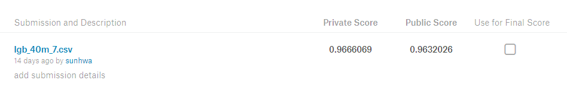

# TalkingData AdTracking Fraud Detection Challenge

### Description
TalkingData, China’s largest independent big data service platform, covers over 70% of active mobile device
s nationwide. They handle 3 billion clicks per day, of which 90% are potentially fraudulent. The goal of the
competition is <U><b>to create an algorithm that predicts whether a user will download an app after clicking a
mobile app ad</b></U>.

 

### Evalution
Submissions are evaluated on <U><b>area under the ROC curve</b></U> between the predicted probability and the
observed target.

 

### Variable
* ip : ip address of click
* app : app id for marketing
* device : device type id of user mobile phone
* os : os version id of user mobile phone
* channel : channel id of mobile ad publisher
* click_time : timestamp of click (UTC)
* attributed_time : if user download the app for after clicking an ad, this is the time of the app download
* is_attributed : the target that is to be predicted, indicating the app was download

---

## Contents Table
☆ : source code  
★ : markdown

1. EDA [☆](01_EDA.py) [★](01_EDA.md)
2. Preprocessing [☆](02_Preprocessing.py) [★](02_Preprocessing.md)
3. Sampling [☆](03_Sampling.py) [★](03_Sampling.md)
4. Modeling [☆](04_Modeling.py) [★](04_Modeling.md)
5. Conclusion [★](05_Conclusion.md)

---

  

---
